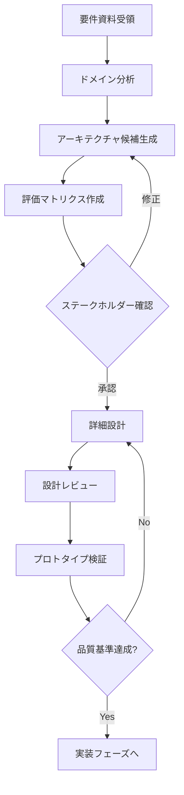

# AI駆動開発におけるシステム設計ガイド

## AI思考方法（Thinking Approach）

### 1. 要件の多層的理解
```
Level 1: 表層理解 → システム化の目的、主要機能
Level 2: 文脈理解 → 業務フローの因果関係、暗黙の制約
Level 3: 本質理解 → ビジネス価値、ステークホルダーの真の課題
```

AIは提示された資料から：
- **明示的要件**：文書に書かれている内容
- **暗黙的要件**：業務フローから推測される必要機能
- **矛盾点**：希望事項と業務フロー間の不整合
を抽出し、設計前に確認します。

### 2. 段階的詳細化アプローチ
```
Phase 1: コンセプトモデル（What）
  └─ システム境界、主要エンティティ、ユースケース

Phase 2: 論理設計（How - 抽象）
  └─ データモデル、プロセスフロー、API設計

Phase 3: 物理設計（How - 具体）
  └─ 技術スタック、インフラ、詳細実装
```

## 検討方法（Design Process）

### Step 1: ドメイン分析
```markdown
【AIの自問自答】
1. このシステムの核心的な価値は何か？
2. どの業務プロセスが最も重要か？
3. データのライフサイクルはどうなっているか？
4. システム境界はどこか？（何をやり、何をやらないか）
```

### Step 2: アーキテクチャ候補の列挙
複数の設計パターンを比較検討：
```
Option A: モノリシック（シンプル、初期開発速度）
Option B: モジュラーモノリス（バランス型）
Option C: マイクロサービス（拡張性、複雑性高）
Option D: サーバーレス（運用負荷低、ベンダーロックイン）

→ プロジェクト制約（予算、期間、チーム規模、将来性）で評価
```

### Step 3: リスク駆動設計
優先順位付け：
```python
# 擬似コード的表現
risks = [
    {"name": "データ整合性", "impact": 9, "probability": 7},
    {"name": "パフォーマンス", "impact": 7, "probability": 5},
    {"name": "セキュリティ", "impact": 10, "probability": 4},
]

# Impact × Probability でソートし、上位リスクに対する設計戦略を先に決定
```

### Step 4: 制約条件の明示化
```
技術的制約: 既存システム連携、技術スタック
ビジネス制約: 予算、納期、段階的リリース要件
組織制約: チームスキル、運用体制
法的制約: GDPR、個人情報保護法、業界規制
```

## 設計検証方法（Design Validation）

### 1. ウォークスルー検証
```markdown
【シナリオベーステスト】
主要業務フローを設計上でシミュレーション：

例）注文処理フロー
1. 顧客が注文 → API Gateway → 注文サービス
2. 在庫確認 → 在庫サービス（同期 or 非同期？）
3. 決済処理 → 決済サービス（失敗時のロールバック戦略は？）
4. 発送指示 → 物流サービス（メッセージキューの耐久性は？）

各ステップで「失敗したらどうなる？」を検証
```

### 2. 品質属性シナリオ
ISO 25010基準で評価：
```
性能: 1000同時ユーザーで応答時間3秒以内
可用性: 年間稼働率99.9%（ダウンタイム8.76時間/年）
セキュリティ: 不正アクセスを検知し30秒以内にブロック
保守性: 新機能追加を平均2週間以内で実装可能
拡張性: ユーザー数10倍増加に1日以内で対応
```

### 3. ADR（Architecture Decision Records）作成
```markdown
## ADR-001: データベースとしてPostgreSQLを選択

### 状況
顧客管理で複雑なリレーションと取引整合性が必要

### 決定
PostgreSQLを採用（NoSQLではなく）

### 理由
- ACID特性が必須
- JSON型でスキーマレスも部分対応可
- チームのスキルセット
- フルテキスト検索の要件

### 結果
- 結合クエリで高性能
- バックアップ/リストア戦略が確立済み
- 水平スケールには別途戦略が必要（将来課題）

### トレードオフ
✓ データ整合性
✗ スケールアウトの容易さ
```

### 4. フェイルポイント分析
```
Single Point of Failure特定：
□ データベースマスターの単一障害点
  → 対策: レプリケーション + 自動フェイルオーバー
  
□ 外部API依存（決済ゲートウェイ）
  → 対策: サーキットブレーカー + フォールバック処理
  
□ セッションストアの揮発性
  → 対策: Redis Cluster + 永続化設定
```

### 5. コスト見積もり検証
```
インフラコスト試算（月額）:
- Compute: $500 (Auto-scaling考慮)
- Database: $300 (IOPS込み)
- Storage: $100
- Network: $150
- Monitoring: $50
合計: $1,100/月

開発コスト:
- 人月単価 × 期間 × 人数
- 技術的負債の返済コスト考慮
```

## AIによる設計プロセス実例



## 実践的チェックリスト

### 設計完了前の必須確認項目
- [ ] すべての主要ユースケースがカバーされている
- [ ] 非機能要件（性能、セキュリティ等）が定量化されている
- [ ] データモデルが第3正規形以上（または意図的な非正規化理由を文書化）
- [ ] エラーハンドリング戦略が全レイヤーで定義されている
- [ ] 監視・ログ戦略が明確
- [ ] CI/CDパイプラインの設計が含まれている
- [ ] セキュリティ脅威モデリングを実施
- [ ] 技術的負債の許容範囲を明示
- [ ] ロールバック戦略が定義されている
- [ ] ドキュメント更新計画がある

## AI設計の強み・弱み認識

**強み：**
- パターン認識と既知のベストプラクティス適用
- 複数案の高速生成と比較
- 整合性チェックの徹底性

**弱み：**
- ビジネス文脈の深い理解（要人間確認）
- 組織の政治的制約の把握
- 革新的なアーキテクチャ発明（既知パターンの組み合わせは可能）

**推奨協働方法：**
AIが複数設計案を生成 → 人間が文脈評価 → AIが詳細化 → 人間が最終判断

---

## 具体的な設計開始時の情報提供項目

AIに効果的な設計を依頼する際は、以下の4つの資料を提示してください：

1. **システム化の目的**
   - ビジネスゴール
   - 解決したい課題
   - 期待される成果

2. **業務フローの詳細**
   - 現状の業務プロセス
   - 関係者とその役割
   - 処理のタイミングと順序

3. **主な管理項目**
   - エンティティとその属性
   - データの関連性
   - ライフサイクル

4. **システム化に向けた希望事項**
   - 必須機能と優先順位
   - 技術的な要望や制約
   - 予算・期間などの制約条件

特に重視すべき点や制約条件があれば併せてお知らせください。
