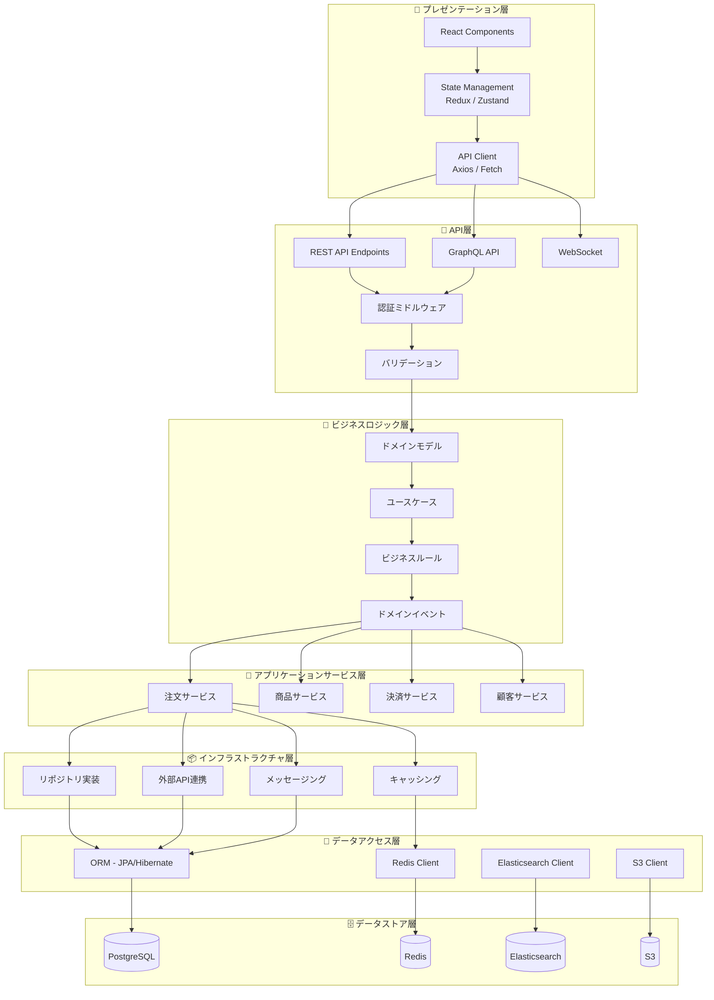
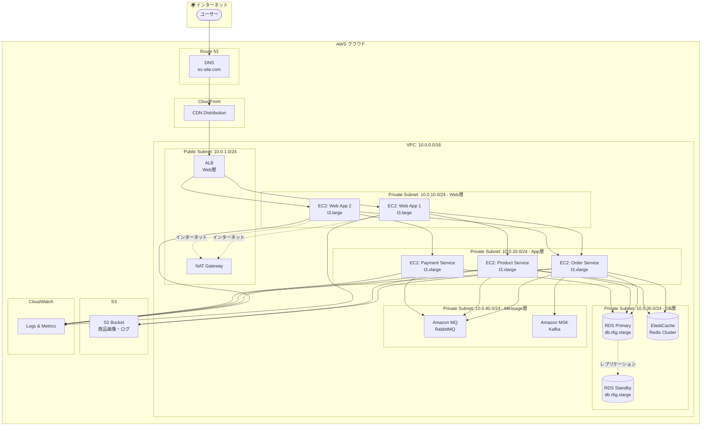
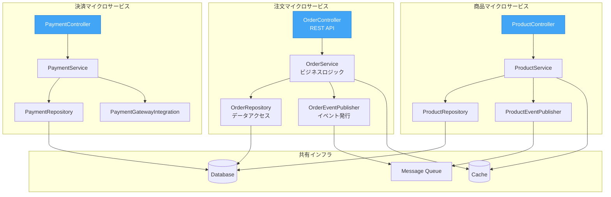
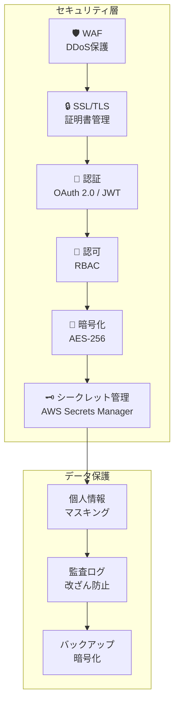
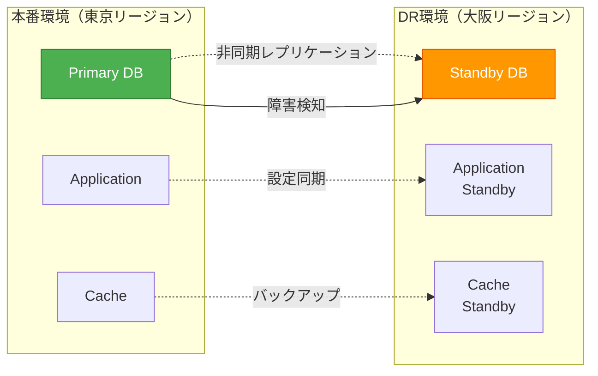

# ECサイト注文処理システム - アーキテクチャ概要図

## アーキテクチャ概要図とは
システムの技術的な構成要素、レイヤー構造、技術スタック、デプロイメント構成を一枚の図で表現する手法です。

---

## 全体アーキテクチャ概要図

```mermaid
graph TB
    subgraph "📱 クライアント層（Presentation Layer）"
        WebBrowser[🌐 Webブラウザ<br/>━━━━━━━━━━<br/>React 18.x<br/>TypeScript<br/>Tailwind CSS]
        
        MobileApp[📱 モバイルアプリ<br/>━━━━━━━━━━<br/>React Native<br/>iOS / Android]
        
        AdminPortal[⚙️ 管理ポータル<br/>━━━━━━━━━━<br/>React Admin<br/>管理者・倉庫用]
    end
    
    subgraph "🌐 CDN / エッジ層（Edge Layer）"
        CDN[☁️ CloudFront CDN<br/>━━━━━━━━━━<br/>静的コンテンツ配信<br/>画像・CSS・JS]
        
        WAF[🛡️ Web Application Firewall<br/>━━━━━━━━━━<br/>AWS WAF<br/>DDoS保護・脅威検知]
    end
    
    subgraph "⚖️ ロードバランサー層（Load Balancer Layer）"
        ALB[⚖️ Application Load Balancer<br/>━━━━━━━━━━<br/>HTTPS終端<br/>ヘルスチェック<br/>SSL/TLS証明書]
    end
    
    subgraph "🚪 APIゲートウェイ層（API Gateway Layer）"
        APIGW[🚪 API Gateway<br/>━━━━━━━━━━<br/>Kong / AWS API Gateway<br/>━━━━━━━━━━<br/>✓ 認証・認可（JWT）<br/>✓ レート制限<br/>✓ APIバージョニング<br/>✓ リクエスト変換<br/>✓ ロギング]
    end
    
    subgraph "🎯 アプリケーション層（Application Layer）"
        direction LR
        
        subgraph "マイクロサービス群"
            OrderSvc[📦 注文サービス<br/>━━━━━━━━━━<br/>Java 17 + Spring Boot 3<br/>━━━━━━━━━━<br/>• 注文受付<br/>• 在庫確認<br/>• 注文ステータス管理<br/>• 配送手配連携]
            
            ProductSvc[🛍️ 商品サービス<br/>━━━━━━━━━━<br/>Java 17 + Spring Boot 3<br/>━━━━━━━━━━<br/>• 商品CRUD<br/>• カテゴリ管理<br/>• 商品検索<br/>• レコメンデーション]
            
            PaymentSvc[💳 決済サービス<br/>━━━━━━━━━━<br/>Java 17 + Spring Boot 3<br/>━━━━━━━━━━<br/>• 決済処理<br/>• 決済GW連携<br/>• 返金処理<br/>• トランザクション管理]
            
            CustomerSvc[👤 顧客サービス<br/>━━━━━━━━━━<br/>Node.js 20 + Express<br/>━━━━━━━━━━<br/>• 会員登録・認証<br/>• プロフィール管理<br/>• 配送先管理<br/>• 購入履歴]
            
            NotifySvc[📧 通知サービス<br/>━━━━━━━━━━<br/>Node.js 20 + Express<br/>━━━━━━━━━━<br/>• メール送信<br/>• SMS送信<br/>• プッシュ通知<br/>• テンプレート管理]
            
            SearchSvc[🔍 検索サービス<br/>━━━━━━━━━━<br/>Python 3.11 + FastAPI<br/>━━━━━━━━━━<br/>• 全文検索<br/>• ファセット検索<br/>• サジェスト<br/>• ランキング]
        end
    end
    
    subgraph "💾 データ層（Data Layer）"
        direction LR
        
        subgraph "リレーショナルDB"
            OrderDB[(📊 注文DB<br/>━━━━━━━━━━<br/>PostgreSQL 15<br/>Multi-AZ<br/>━━━━━━━━━━<br/>注文・配送・決済)]
            
            ProductDB[(🛍️ 商品DB<br/>━━━━━━━━━━<br/>PostgreSQL 15<br/>Multi-AZ<br/>━━━━━━━━━━<br/>商品・在庫・カテゴリ)]
            
            CustomerDB[(👤 顧客DB<br/>━━━━━━━━━━<br/>PostgreSQL 15<br/>Multi-AZ<br/>━━━━━━━━━━<br/>会員・配送先・履歴)]
        end
        
        subgraph "NoSQL / キャッシュ"
            Redis[(⚡ Redis<br/>━━━━━━━━━━<br/>Cluster Mode<br/>━━━━━━━━━━<br/>セッション<br/>商品キャッシュ<br/>カート情報)]
            
            Elasticsearch[(🔍 Elasticsearch<br/>━━━━━━━━━━<br/>Cluster<br/>━━━━━━━━━━<br/>商品検索<br/>ログ検索)]
        end
        
        subgraph "オブジェクトストレージ"
            S3[(📦 Amazon S3<br/>━━━━━━━━━━<br/>商品画像<br/>請求書PDF<br/>ログアーカイブ)]
        end
    end
    
    subgraph "📨 メッセージング層（Messaging Layer）"
        RabbitMQ[🐰 RabbitMQ<br/>━━━━━━━━━━<br/>クラスタ構成<br/>━━━━━━━━━━<br/>• 注文イベント<br/>• 通知キュー<br/>• 在庫更新イベント<br/>• 非同期処理]
        
        Kafka[📊 Apache Kafka<br/>━━━━━━━━━━<br/>分散クラスタ<br/>━━━━━━━━━━<br/>• イベントストリーミング<br/>• ログ収集<br/>• データ分析連携]
    end
    
    subgraph "🔗 外部連携層（External Integration Layer）"
        PaymentGW[💳 決済ゲートウェイ<br/>━━━━━━━━━━<br/>Stripe / PayPal<br/>REST API]
        
        DeliveryAPI[🚚 配送業者API<br/>━━━━━━━━━━<br/>ヤマト・佐川<br/>SOAP / REST API]
        
        EmailAPI[📧 メールAPI<br/>━━━━━━━━━━<br/>SendGrid<br/>REST API]
        
        SMSAPI[📱 SMS API<br/>━━━━━━━━━━<br/>Twilio<br/>REST API]
        
        InventoryAPI[📦 在庫システムAPI<br/>━━━━━━━━━━<br/>WMS<br/>REST API]
    end
    
    subgraph "📊 監視・ログ層（Observability Layer）"
        Prometheus[📈 Prometheus<br/>━━━━━━━━━━<br/>メトリクス収集]
        
        Grafana[📊 Grafana<br/>━━━━━━━━━━<br/>ダッシュボード]
        
        ELK[📋 ELK Stack<br/>━━━━━━━━━━<br/>Elasticsearch<br/>Logstash<br/>Kibana<br/>━━━━━━━━━━<br/>ログ集約・可視化]
        
        Jaeger[🔍 Jaeger<br/>━━━━━━━━━━<br/>分散トレーシング]
    end
    
    %% ========================================
    %% フロー定義
    %% ========================================
    
    WebBrowser --> CDN
    MobileApp --> CDN
    AdminPortal --> CDN
    
    CDN --> WAF
    WAF --> ALB
    ALB --> APIGW
    
    APIGW --> OrderSvc
    APIGW --> ProductSvc
    APIGW --> PaymentSvc
    APIGW --> CustomerSvc
    APIGW --> SearchSvc
    
    OrderSvc --> OrderDB
    ProductSvc --> ProductDB
    CustomerSvc --> CustomerDB
    PaymentSvc --> OrderDB
    
    ProductSvc --> Redis
    CustomerSvc --> Redis
    APIGW --> Redis
    
    SearchSvc --> Elasticsearch
    
    OrderSvc --> S3
    PaymentSvc --> S3
    
    OrderSvc --> RabbitMQ
    PaymentSvc --> RabbitMQ
    NotifySvc --> RabbitMQ
    
    OrderSvc --> Kafka
    ProductSvc --> Kafka
    
    PaymentSvc --> PaymentGW
    OrderSvc --> DeliveryAPI
    OrderSvc --> InventoryAPI
    NotifySvc --> EmailAPI
    NotifySvc --> SMSAPI
    
    OrderSvc --> Prometheus
    ProductSvc --> Prometheus
    PaymentSvc --> Prometheus
    CustomerSvc --> Prometheus
    
    Prometheus --> Grafana
    
    OrderSvc --> ELK
    ProductSvc --> ELK
    PaymentSvc --> ELK
    
    OrderSvc --> Jaeger
    ProductSvc --> Jaeger
    PaymentSvc --> Jaeger
    
    %% ========================================
    %% スタイル定義
    %% ========================================
    
    style WebBrowser fill:#4CAF50,stroke:#2E7D32,color:#fff
    style MobileApp fill:#4CAF50,stroke:#2E7D32,color:#fff
    style AdminPortal fill:#4CAF50,stroke:#2E7D32,color:#fff
    
    style CDN fill:#2196F3,stroke:#1565C0,color:#fff
    style WAF fill:#F44336,stroke:#C62828,color:#fff
    style ALB fill:#FF9800,stroke:#E65100,color:#fff
    
    style APIGW fill:#9C27B0,stroke:#6A1B9A,color:#fff
    
    style OrderSvc fill:#00BCD4,stroke:#00838F,color:#fff
    style ProductSvc fill:#00BCD4,stroke:#00838F,color:#fff
    style PaymentSvc fill:#00BCD4,stroke:#00838F,color:#fff
    style CustomerSvc fill:#00BCD4,stroke:#00838F,color:#fff
    style NotifySvc fill:#00BCD4,stroke:#00838F,color:#fff
    style SearchSvc fill:#00BCD4,stroke:#00838F,color:#fff
    
    style OrderDB fill:#4CAF50,stroke:#2E7D32,color:#fff
    style ProductDB fill:#4CAF50,stroke:#2E7D32,color:#fff
    style CustomerDB fill:#4CAF50,stroke:#2E7D32,color:#fff
    style Redis fill:#FF5722,stroke:#D84315,color:#fff
    style Elasticsearch fill:#FFC107,stroke:#F57C00,color:#000
    style S3 fill:#4CAF50,stroke:#2E7D32,color:#fff
    
    style RabbitMQ fill:#FF9800,stroke:#E65100,color:#fff
    style Kafka fill:#FF5722,stroke:#D84315,color:#fff
```

---

## レイヤーアーキテクチャ（詳細）

---

## デプロイメントアーキテクチャ（AWS）

---

## マイクロサービスアーキテクチャ詳細

---

## 技術スタック一覧

### フロントエンド

| カテゴリ | 技術 | バージョン | 用途 |
|---------|------|-----------|------|
| **フレームワーク** | React | 18.2.0 | UI構築 |
| **言語** | TypeScript | 5.0 | 型安全性 |
| **状態管理** | Redux Toolkit | 1.9 | グローバル状態 |
| **スタイリング** | Tailwind CSS | 3.3 | UIデザイン |
| **ルーティング** | React Router | 6.10 | SPA ルーティング |
| **HTTP Client** | Axios | 1.4 | API通信 |
| **フォーム** | React Hook Form | 7.43 | フォーム管理 |
| **UI Component** | Material-UI | 5.12 | コンポーネントライブラリ |

### バックエンド

| カテゴリ | 技術 | バージョン | 用途 |
|---------|------|-----------|------|
| **言語** | Java | 17 LTS | メインサービス |
| **フレームワーク** | Spring Boot | 3.1 | アプリケーション基盤 |
| **ORM** | Hibernate / JPA | 6.2 | データベースアクセス |
| **API仕様** | OpenAPI / Swagger | 3.0 | API ドキュメント |
| **認証** | Spring Security + JWT | 6.1 | セキュリティ |
| **バリデーション** | Hibernate Validator | 8.0 | 入力検証 |
| **ロギング** | Logback + SLF4J | 1.4 | ログ管理 |
| **メトリクス** | Micrometer | 1.11 | 監視メトリクス |

### 通知・非同期処理

| カテゴリ | 技術 | バージョン | 用途 |
|---------|------|-----------|------|
| **ランタイム** | Node.js | 20 LTS | 通知サービス |
| **フレームワーク** | Express | 4.18 | REST API |
| **メッセージング** | RabbitMQ | 3.12 | メッセージキュー |
| **ストリーミング** | Apache Kafka | 3.5 | イベントストリーミング |

### データベース・ストレージ

| カテゴリ | 技術 | バージョン | 用途 |
|---------|------|-----------|------|
| **RDBMS** | PostgreSQL | 15.3 | トランザクションデータ |
| **キャッシュ** | Redis | 7.0 | セッション・キャッシュ |
| **検索** | Elasticsearch | 8.8 | 全文検索 |
| **オブジェクトストレージ** | Amazon S3 | - | 画像・ファイル |

### インフラ・DevOps

| カテゴリ | 技術 | バージョン | 用途 |
|---------|------|-----------|------|
| **コンテナ** | Docker | 24.0 | コンテナ化 |
| **オーケストレーション** | Kubernetes | 1.27 | コンテナ管理 |
| **CI/CD** | GitHub Actions | - | 自動デプロイ |
| **IaC** | Terraform | 1.5 | インフラ構築 |
| **監視** | Prometheus + Grafana | 2.45 / 10.0 | メトリクス監視 |
| **ログ** | ELK Stack | 8.8 | ログ集約 |
| **トレーシング** | Jaeger | 1.47 | 分散トレーシング |

---

## セキュリティアーキテクチャ

---

## スケーラビリティ戦略

### 水平スケーリング

| 層 | スケーリング方法 | トリガー | 最小/最大 |
|----|---------------|---------|----------|
| **Web層** | Auto Scaling Group | CPU > 70% | 2 / 10 |
| **App層** | Kubernetes HPA | CPU > 60% | 3 / 20 |
| **DB層** | Read Replica | 読み取り負荷 | 1 / 5 |
| **Cache層** | Redis Cluster | メモリ使用率 > 80% | 3 / 9 |

### 垂直スケーリング

| コンポーネント | 通常時 | ピーク時 |
|--------------|-------|---------|
| **Webサーバー** | t3.large | t3.2xlarge |
| **APサーバー** | t3.xlarge | r6g.2xlarge |
| **DBサーバー** | db.r6g.xlarge | db.r6g.4xlarge |

---

## 障害復旧アーキテクチャ

### RTO / RPO

| 項目 | 目標値 | 実現方法 |
|-----|-------|---------|
| **RTO** | 1時間 | 自動フェイルオーバー、DR環境 |
| **RPO** | 5分 | 継続的レプリケーション |

---

## まとめ

### アーキテクチャの特徴

✅ **マイクロサービス**: ドメイン駆動設計による疎結合  
✅ **スケーラビリティ**: 水平・垂直の両方向にスケール可能  
✅ **高可用性**: Multi-AZ、Auto Scaling、ヘルスチェック  
✅ **セキュリティ**: 多層防御、暗号化、最小権限の原則  
✅ **可観測性**: メトリクス、ログ、トレースの統合監視  
✅ **クラウドネイティブ**: AWS マネージドサービス活用  

### 非機能要件の達成

| 要件 | 目標 | 実現方法 |
|-----|------|---------|
| **可用性** | 99.95% | Multi-AZ、Auto Scaling、ヘルスチェック |
| **パフォーマンス** | 応答時間 < 2秒 | CDN、キャッシュ、DB最適化 |
| **スケーラビリティ** | 10万req/分 | 水平スケーリング、ロードバランサー |
| **セキュリティ** | PCI DSS準拠 | WAF、暗号化、監査ログ |
| **復旧性** | RTO 1時間 | DRサイト、自動バックアップ |
