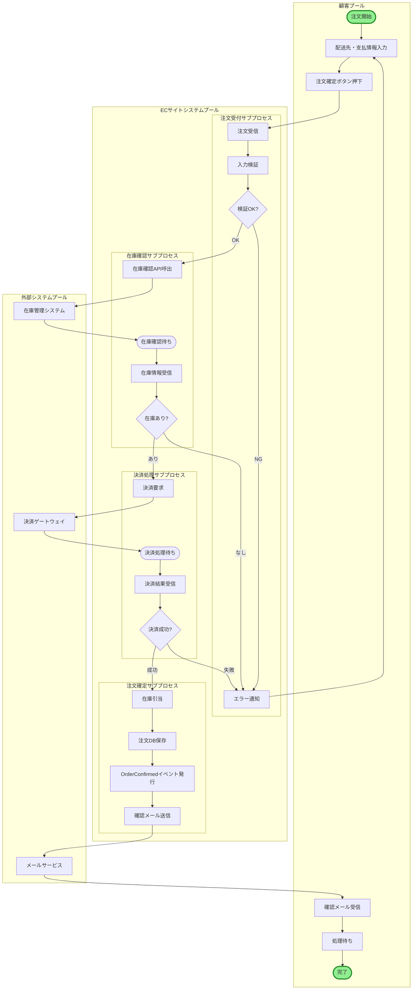
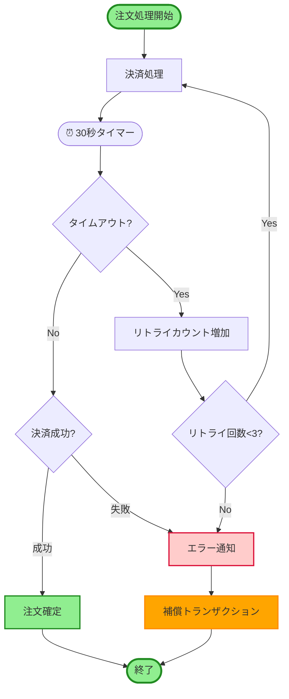
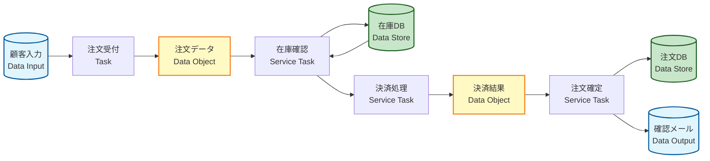
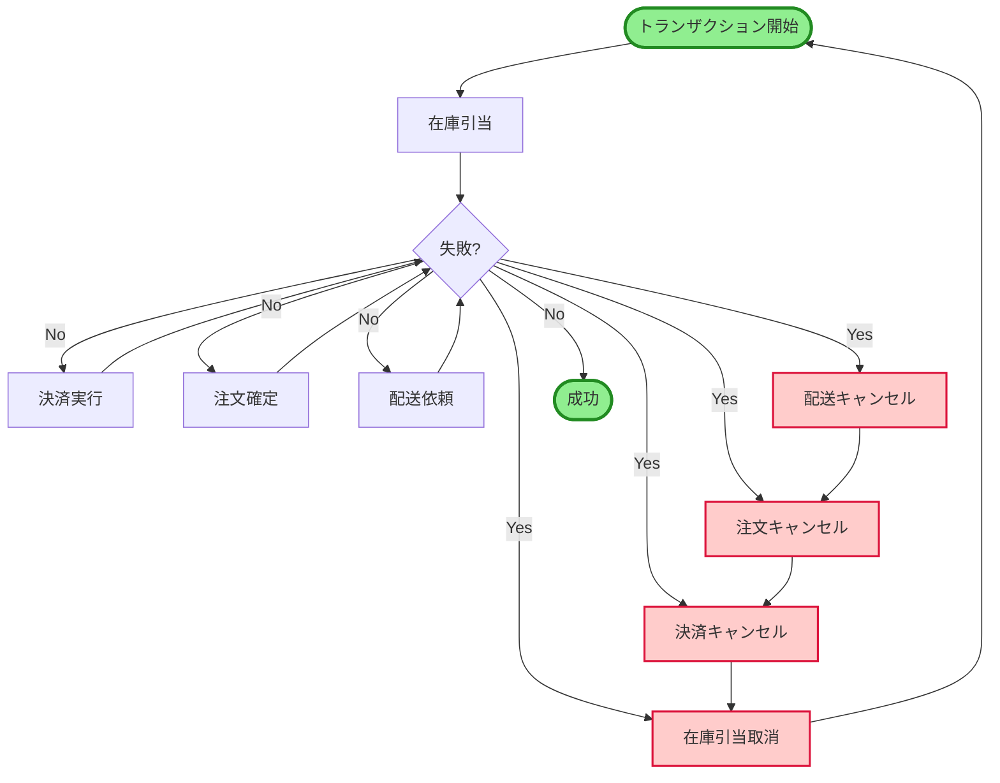

# ECサイト注文処理システム - BPMN (Business Process Model and Notation)

## BPMNとは
ビジネスプロセスを標準化された記法で図式化する手法です。プロセス、イベント、ゲートウェイ、データオブジェクトを使用して業務フローを詳細に表現します。

---

## BPMN 概要図（全体プロセス）

```mermaid
graph TB
    %% ========================================
    %% 開始イベント
    %% ========================================
    Start([🎯 顧客が商品閲覧開始])
    
    %% ========================================
    %% タスク（処理）
    %% ========================================
    BrowseProducts[📱 商品閲覧<br/>Task]
    AddToCart[🛒 カートに追加<br/>Task]
    ReviewCart[👁️ カート内容確認<br/>Task]
    InputAddress[📝 配送先入力<br/>Task]
    SelectPayment[💳 支払方法選択<br/>Task]
    ConfirmOrder[✅ 注文確定<br/>Task]
    
    CheckInventory[📦 在庫確認<br/>Service Task]
    ProcessPayment[💰 決済処理<br/>Service Task]
    ReserveInventory[🔒 在庫引当<br/>Service Task]
    SaveOrder[💾 注文保存<br/>Service Task]
    SendConfirmEmail[📧 確認メール送信<br/>Send Task]
    
    RequestShipment[📮 配送依頼<br/>Service Task]
    GeneratePickingList[📋 ピッキングリスト生成<br/>Service Task]
    PickItems[📦 商品ピッキング<br/>Manual Task]
    PackItems[📦 梱包作業<br/>Manual Task]
    HandoverToCarrier[🚚 配送業者引渡<br/>Manual Task]
    
    UpdateShipmentStatus[📍 配送ステータス更新<br/>Service Task]
    SendShipmentEmail[📧 発送通知送信<br/>Send Task]
    DeliverPackage[🏠 配送<br/>Manual Task]
    SendDeliveryEmail[📧 配送完了通知<br/>Send Task]
    
    %% ========================================
    %% ゲートウェイ（分岐・合流）
    %% ========================================
    GW1{🔀 カートに追加?<br/>XOR Gateway}
    GW2{🔀 注文実行?<br/>XOR Gateway}
    GW3{🔀 在庫あり?<br/>XOR Gateway}
    GW4{🔀 決済成功?<br/>XOR Gateway}
    GW5{🔀 梱包完了?<br/>XOR Gateway}
    
    %% ========================================
    %% 中間イベント
    %% ========================================
    InventoryChecked([📊 在庫確認完了<br/>Intermediate Event])
    PaymentCompleted([💳 決済完了<br/>Intermediate Event])
    OrderConfirmed([✅ 注文確定<br/>Intermediate Event])
    ShipmentReady([📦 出荷準備完了<br/>Intermediate Event])
    Shipped([🚚 出荷完了<br/>Intermediate Event])
    
    %% ========================================
    %% 終了イベント
    %% ========================================
    EndSuccess([🎉 注文完了<br/>End Event])
    EndCancelled([❌ 注文キャンセル<br/>End Event])
    EndInventoryShortage([⚠️ 在庫不足終了<br/>End Event])
    EndPaymentFailed([💔 決済失敗終了<br/>End Event])
    
    %% ========================================
    %% フロー
    %% ========================================
    Start --> BrowseProducts
    BrowseProducts --> GW1
    
    GW1 -->|はい| AddToCart
    GW1 -->|いいえ| BrowseProducts
    
    AddToCart --> ReviewCart
    ReviewCart --> GW2
    
    GW2 -->|注文する| InputAddress
    GW2 -->|買い物を続ける| BrowseProducts
    GW2 -->|キャンセル| EndCancelled
    
    InputAddress --> SelectPayment
    SelectPayment --> ConfirmOrder
    ConfirmOrder --> CheckInventory
    
    CheckInventory --> InventoryChecked
    InventoryChecked --> GW3
    
    GW3 -->|在庫あり| ProcessPayment
    GW3 -->|在庫不足| EndInventoryShortage
    
    ProcessPayment --> PaymentCompleted
    PaymentCompleted --> GW4
    
    GW4 -->|成功| ReserveInventory
    GW4 -->|失敗| EndPaymentFailed
    
    ReserveInventory --> SaveOrder
    SaveOrder --> OrderConfirmed
    OrderConfirmed --> SendConfirmEmail
    SendConfirmEmail --> RequestShipment
    
    RequestShipment --> GeneratePickingList
    GeneratePickingList --> PickItems
    PickItems --> PackItems
    PackItems --> GW5
    
    GW5 -->|完了| HandoverToCarrier
    GW5 -->|不備あり| PickItems
    
    HandoverToCarrier --> ShipmentReady
    ShipmentReady --> UpdateShipmentStatus
    UpdateShipmentStatus --> SendShipmentEmail
    SendShipmentEmail --> Shipped
    
    Shipped --> DeliverPackage
    DeliverPackage --> SendDeliveryEmail
    SendDeliveryEmail --> EndSuccess
    
    %% ========================================
    %% スタイル
    %% ========================================
    style Start fill:#90ee90,stroke:#228b22,stroke-width:3px
    style EndSuccess fill:#90ee90,stroke:#228b22,stroke-width:3px
    style EndCancelled fill:#ffcccb,stroke:#dc143c,stroke-width:3px
    style EndInventoryShortage fill:#ffcccb,stroke:#dc143c,stroke-width:3px
    style EndPaymentFailed fill:#ffcccb,stroke:#dc143c,stroke-width:3px
    
    style CheckInventory fill:#add8e6,stroke:#4682b4,stroke-width:2px
    style ProcessPayment fill:#add8e6,stroke:#4682b4,stroke-width:2px
    style ReserveInventory fill:#add8e6,stroke:#4682b4,stroke-width:2px
    style SaveOrder fill:#add8e6,stroke:#4682b4,stroke-width:2px
    style RequestShipment fill:#add8e6,stroke:#4682b4,stroke-width:2px
    style UpdateShipmentStatus fill:#add8e6,stroke:#4682b4,stroke-width:2px
    
    style PickItems fill:#ffe4b5,stroke:#ffa500,stroke-width:2px
    style PackItems fill:#ffe4b5,stroke:#ffa500,stroke-width:2px
    style HandoverToCarrier fill:#ffe4b5,stroke:#ffa500,stroke-width:2px
    style DeliverPackage fill:#ffe4b5,stroke:#ffa500,stroke-width:2px
    
    style GW1 fill:#ffff99,stroke:#ffd700,stroke-width:2px
    style GW2 fill:#ffff99,stroke:#ffd700,stroke-width:2px
    style GW3 fill:#ffff99,stroke:#ffd700,stroke-width:2px
    style GW4 fill:#ffff99,stroke:#ffd700,stroke-width:2px
    style GW5 fill:#ffff99,stroke:#ffd700,stroke-width:2px
```

---

## BPMN 詳細プロセス（注文処理フォーカス）

---

## BPMN要素の説明

### イベント（Events）

| 記号 | 名称 | 説明 | 例 |
|-----|------|------|-----|
| ⭕ | 開始イベント | プロセスの開始点 | 顧客が商品閲覧開始 |
| ⭕ | 中間イベント | プロセス途中で発生するイベント | 決済完了、在庫確認完了 |
| ⭕⭕ | 終了イベント | プロセスの終了点 | 注文完了、キャンセル |
| 📧 | メッセージイベント | メッセージ送受信 | メール送信 |
| ⏰ | タイマーイベント | 時間ベースのトリガー | 3日後にリマインド |

### タスク（Tasks）

| 種類 | アイコン | 説明 | 例 |
|-----|---------|------|-----|
| **User Task** | 👤 | 人間が行うタスク | 配送先入力 |
| **Service Task** | ⚙️ | システムが自動実行 | 在庫確認API呼出 |
| **Manual Task** | ✋ | システム外で人間が実行 | 商品ピッキング |
| **Send Task** | 📧 | メッセージ送信 | 確認メール送信 |
| **Receive Task** | 📥 | メッセージ受信 | 決済結果受信 |
| **Script Task** | 📜 | スクリプト実行 | 価格計算 |

### ゲートウェイ（Gateways）

| 種類 | 記号 | 説明 | 例 |
|-----|------|------|-----|
| **XOR（排他）** | ◇ | 1つの経路のみ選択 | 在庫あり/なし |
| **AND（並列）** | ◇+ | すべての経路を実行 | メール送信と在庫更新を並列 |
| **OR（包含）** | ◇O | 1つ以上の経路を選択 | 通常配送または速達 |

### データオブジェクト

| 要素 | 説明 | 例 |
|-----|------|-----|
| **Data Object** | プロセスで使用されるデータ | 注文情報、顧客情報 |
| **Data Store** | データの永続化場所 | 注文DB、商品DB |
| **Message** | システム間で交換される情報 | 決済要求、配送依頼 |

---

## 詳細フロー：注文から配送まで

```mermaid
graph TB
    Start([開始])
    
    %% 注文受付フェーズ
    T1[商品選択]
    T2[カートに追加]
    T3[配送先入力]
    T4[支払方法選択]
    T5[注文確定]
    
    %% 検証フェーズ
    G1{入力検証}
    E1[エラー表示]
    
    %% 在庫確認フェーズ
    S1[在庫確認API呼出]
    M1([在庫確認要求])
    M2([在庫情報受信])
    G2{在庫あり?}
    E2[在庫不足通知]
    
    %% 決済フェーズ
    S2[決済API呼出]
    M3([決済要求])
    M4([決済結果受信])
    G3{決済成功?}
    E3[決済エラー通知]
    
    %% 注文確定フェーズ
    S3[在庫引当]
    S4[注文DB保存]
    S5[注文確定イベント発行]
    
    %% 通知フェーズ
    P1[確認メール送信]
    P2[SMS通知送信]
    G4[AND Gateway]
    
    %% 配送手配フェーズ
    S6[配送API呼出]
    M5([配送依頼])
    M6([配送番号受信])
    S7[配送情報DB保存]
    P3[発送通知メール]
    
    %% 倉庫作業フェーズ
    T6[ピッキングリスト印刷]
    T7[商品ピッキング]
    T8[梱包作業]
    G5{品質チェック}
    T9[再梱包]
    T10[配送業者引渡]
    
    %% 配送フェーズ
    T11[配送中]
    T12[配送完了]
    P4[配送完了通知]
    
    End([終了])
    
    %% フロー定義
    Start --> T1
    T1 --> T2
    T2 --> T3
    T3 --> T4
    T4 --> T5
    T5 --> G1
    
    G1 -->|OK| S1
    G1 -->|NG| E1
    E1 --> T3
    
    S1 --> M1
    M1 --> M2
    M2 --> G2
    
    G2 -->|あり| S2
    G2 -->|なし| E2
    E2 --> End
    
    S2 --> M3
    M3 --> M4
    M4 --> G3
    
    G3 -->|成功| S3
    G3 -->|失敗| E3
    E3 --> End
    
    S3 --> S4
    S4 --> S5
    S5 --> G4
    
    G4 --> P1
    G4 --> P2
    
    P1 --> S6
    P2 --> S6
    
    S6 --> M5
    M5 --> M6
    M6 --> S7
    S7 --> P3
    P3 --> T6
    
    T6 --> T7
    T7 --> T8
    T8 --> G5
    
    G5 -->|OK| T10
    G5 -->|NG| T9
    T9 --> T8
    
    T10 --> T11
    T11 --> T12
    T12 --> P4
    P4 --> End
    
    %% スタイル
    style Start fill:#90ee90,stroke:#228b22,stroke-width:3px
    style End fill:#90ee90,stroke:#228b22,stroke-width:3px
    style G1 fill:#ffff99,stroke:#ffd700,stroke-width:2px
    style G2 fill:#ffff99,stroke:#ffd700,stroke-width:2px
    style G3 fill:#ffff99,stroke:#ffd700,stroke-width:2px
    style G4 fill:#87ceeb,stroke:#4682b4,stroke-width:2px
    style G5 fill:#ffff99,stroke:#ffd700,stroke-width:2px
    style E1 fill:#ffcccb,stroke:#dc143c,stroke-width:2px
    style E2 fill:#ffcccb,stroke:#dc143c,stroke-width:2px
    style E3 fill:#ffcccb,stroke:#dc143c,stroke-width:2px
```

---

## エラーハンドリングとタイムアウト

---

## データフロー（データオブジェクト付き）

---

## プロセスメトリクス

### KPI（主要業績評価指標）

| メトリクス | 目標値 | 測定方法 |
|-----------|-------|---------|
| **注文完了率** | 95%以上 | 完了注文数 ÷ 開始注文数 |
| **平均処理時間** | 5分以内 | 注文確定ボタン押下から確認メール送信まで |
| **決済成功率** | 98%以上 | 決済成功数 ÷ 決済試行数 |
| **在庫確認時間** | 2秒以内 | 在庫API応答時間 |
| **エラー率** | 2%以下 | エラー発生数 ÷ 総処理数 |

### サイクルタイム

| プロセス | 最小 | 平均 | 最大 |
|---------|-----|------|------|
| **注文受付** | 30秒 | 2分 | 5分 |
| **在庫確認** | 0.5秒 | 1秒 | 3秒 |
| **決済処理** | 2秒 | 5秒 | 30秒 |
| **注文確定** | 1秒 | 2秒 | 5秒 |
| **配送手配** | 5秒 | 10秒 | 30秒 |
| **商品ピッキング** | 3分 | 10分 | 30分 |
| **梱包作業** | 2分 | 5分 | 15分 |
| **配送** | 1日 | 2日 | 5日 |

---

## 補償トランザクション（Saga パターン）

---

## まとめ

### BPMNの利点

✅ **標準化**: 国際標準（ISO/IEC 19510）に準拠  
✅ **詳細性**: タスク、イベント、ゲートウェイで詳細なフロー表現  
✅ **実行可能**: BPMNエンジンで直接実行可能  
✅ **可視化**: ビジネスとITの共通言語  
✅ **分析**: プロセス最適化のための分析基盤  

### 活用シーン

- **業務分析**: 現状プロセスの可視化と問題点発見
- **要件定義**: システム化範囲の明確化
- **設計**: ワークフローエンジンの設計仕様
- **自動化**: RPA・BPMエンジンでの実行
- **監視**: プロセスマイニングによる改善
