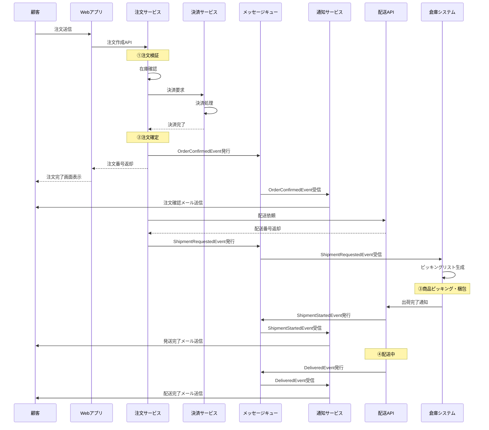

# ECサイト注文処理システム - C4モデル

## C4モデルとは
C4モデルは、ソフトウェアアーキテクチャを4つのレベル（Context、Container、Component、Code）で段階的に詳細化していく手法です。

---

## レベル1: システムコンテキスト図
**誰がシステムを使うのか、どの外部システムと連携するのかを俯瞰**

### システムコンテキスト図の説明

| 要素 | タイプ | 説明 |
|-----|--------|------|
| 顧客 | Person | ECサイトで商品を購入するエンドユーザー |
| 管理者 | Person | 商品や注文を管理する内部ユーザー |
| 倉庫担当者 | Person | 出荷処理と在庫を管理する内部ユーザー |
| ECサイト注文処理システム | Software System | 本システム（注文受付から配送まで管理） |
| 決済ゲートウェイ | External System | クレジットカード決済を処理する外部サービス |
| 配送業者API | External System | 配送手配と追跡を行う外部サービス |
| メール送信サービス | External System | トランザクションメールを送信する外部サービス |
| 在庫管理システム | External System | 倉庫の在庫をリアルタイムで管理する既存システム |

---

## レベル2: コンテナ図
**システム内部の主要なアプリケーションとデータストアの構成**

### コンテナ図の説明

| コンテナ | 技術 | 責務 |
|---------|------|------|
| Webアプリケーション | React SPA | 顧客向けUI（商品閲覧、カート、注文） |
| 管理画面 | React SPA | 管理者・倉庫担当者向けUI |
| APIゲートウェイ | Node.js/Express | 認証、ルーティング、レート制限 |
| 注文サービス | Java/Spring Boot | 注文受付、在庫確認、配送手配 |
| 商品サービス | Java/Spring Boot | 商品CRUD、カテゴリ管理 |
| 決済サービス | Java/Spring Boot | 決済処理、トランザクション管理 |
| 通知サービス | Node.js | メール送信、通知管理 |
| 注文DB | PostgreSQL | 注文、配送、決済データの永続化 |
| 商品DB | PostgreSQL | 商品、カテゴリ、在庫データ |
| 顧客DB | PostgreSQL | 顧客情報、配送先、購入履歴 |
| キャッシュ | Redis | セッション、商品情報のキャッシュ |
| メッセージキュー | RabbitMQ | 非同期処理（メール送信、在庫更新） |

---

## レベル3: コンポーネント図（注文サービスの詳細）
**注文サービス内部の主要コンポーネント**

---

## 統合ビュー: データ・イベント・物の流れ

### データ・イベント・物の流れの説明

| フェーズ | データの流れ | イベント | 物の流れ |
|---------|------------|---------|---------|
| ①-② | 注文データ送信 | 注文開始イベント | - |
| ③-④ | 在庫確認API呼び出し | 在庫確認イベント | - |
| ⑤-⑥ | 決済データ送信・受信 | 決済完了イベント | - |
| ⑦ | 注文データDB保存 | 注文確定イベント | - |
| ⑧-⑨ | メッセージキュー経由 | 通知要求イベント | - |
| ⑩-⑪ | メール送信 | メール送信完了イベント | - |
| ⑫ | 配送依頼データ送信 | 配送手配イベント | - |
| ⑬ | 出荷指示データ | 出荷指示イベント | 伝票発行 |
| ⑭ | - | ピッキング完了イベント | 商品梱包・出荷 |
| ⑮ | 配送追跡データ更新 | 配送中・配送完了イベント | 商品配送 |

---

## イベント駆動アーキテクチャ

---

## システムアーキテクチャの特徴

### 1. マイクロサービスアーキテクチャ
- 注文、商品、決済を独立したサービスとして分離
- 各サービスは独自のデータベースを持つ（Database per Service）
- サービス間の疎結合を実現

### 2. イベント駆動設計
- メッセージキューによる非同期処理
- 注文確定、配送開始などの重要イベントを発行
- システム間の依存関係を削減

### 3. API Gatewayパターン
- クライアントとサービス間の単一エントリーポイント
- 認証・認可の一元管理
- レート制限、ロギング、モニタリング

### 4. キャッシング戦略
- Redisによる商品情報、セッション情報のキャッシュ
- データベース負荷の軽減
- レスポンス速度の向上

### 5. 外部システム連携
- 決済ゲートウェイ：PCI DSS準拠の外部サービス利用
- 配送業者API：リアルタイム配送追跡
- 在庫管理システム：既存システムとのREST API連携

---

## 非機能要件の実現方法

| 要件 | 実現方法 |
|-----|---------|
| **可用性** | ロードバランサー、複数インスタンス、ヘルスチェック |
| **拡張性** | 水平スケーリング、マイクロサービス、キャッシュ |
| **パフォーマンス** | Redis キャッシュ、DB インデックス、CDN |
| **セキュリティ** | HTTPS、JWT認証、APIキー管理、入力検証 |
| **監視** | ログ集約、メトリクス収集、分散トレーシング |
| **障害対応** | サーキットブレーカー、リトライ、タイムアウト |
| **データ整合性** | トランザクション、Saga パターン、イベントソーシング |

---

## デプロイメント図（参考）

---

## まとめ

このC4モデルドキュメントは、ECサイト注文処理システムを以下の観点で包括的に表現しています：

### ✅ 含まれる要素
- **データの流れ**: API呼び出し、DB操作、メッセージング
- **データベース**: 注文DB、商品DB、顧客DB、キャッシュ
- **顧客**: 顧客、管理者、倉庫担当者
- **イベント**: 注文確定、決済完了、配送開始などのビジネスイベント
- **物の流れ**: 倉庫からのピッキング、配送、顧客への到着
- **プロセス**: 注文受付、在庫確認、決済、配送手配
- **外部システム**: 決済GW、配送API、在庫システム、メールサービス

### 📊 4つのレベル
1. **コンテキスト図**: システム全体の俯瞰
2. **コンテナ図**: 技術スタックと主要コンポーネント
3. **コンポーネント図**: サービス内部の詳細設計
4. **統合ビュー**: データ・イベント・物の流れの統合表現

このドキュメントを使用することで、ステークホルダー全員が同じシステムイメージを共有できます。
