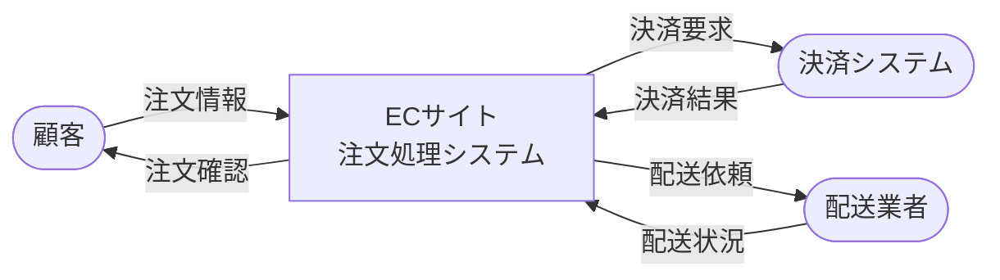
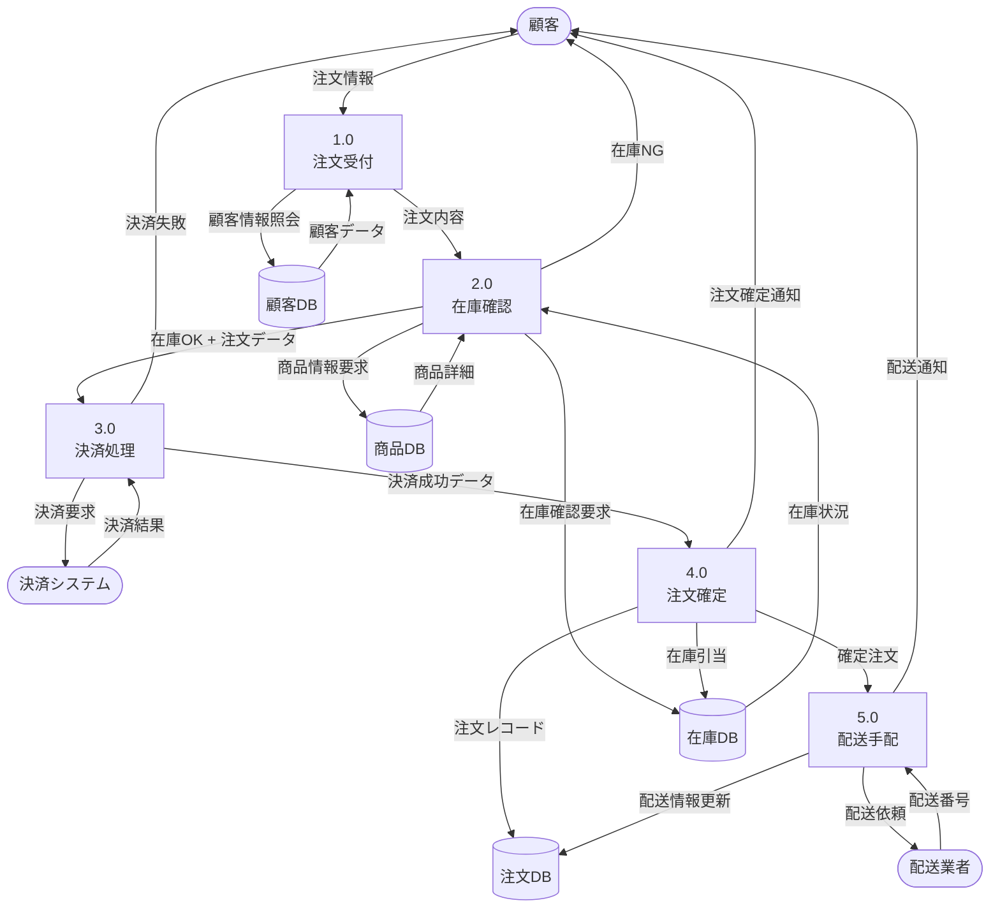
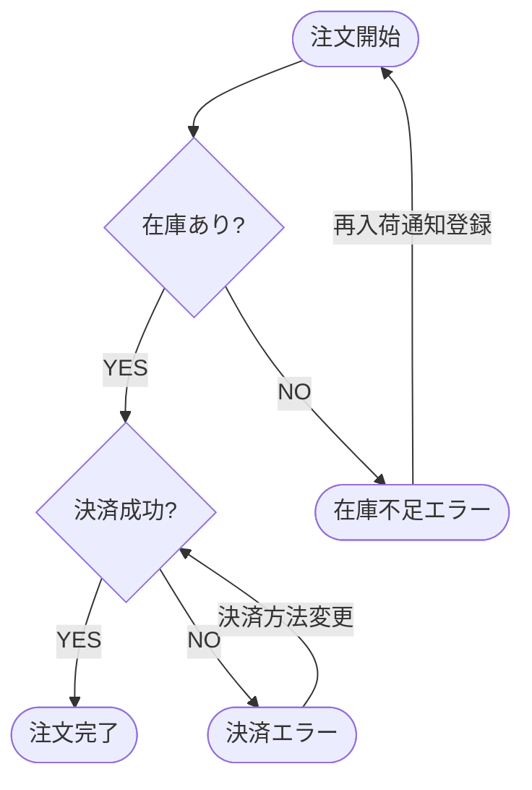

# ECサイト注文処理 - データフローダイアグラム

## システム概要
ECサイトにおける顧客の注文から配送完了までのデータフローを可視化したものです。

## レベル0 DFD（コンテキスト図）

## レベル1 DFD（詳細プロセス）

## データフロー詳細

### 1. 注文受付プロセス
| データフロー | 内容 |
|------------|------|
| 顧客 → 注文受付 | 商品ID、数量、配送先情報 |
| 注文受付 ↔ 顧客DB | 顧客ID、会員情報、配送先履歴 |
| 注文受付 → 在庫確認 | 注文ID、商品リスト、数量 |

### 2. 在庫確認プロセス
| データフロー | 内容 |
|------------|------|
| 在庫確認 ↔ 商品DB | 商品ID、価格、商品名、商品詳細 |
| 在庫確認 ↔ 在庫DB | 商品ID、現在庫数、引当可能数 |
| 在庫確認 → 決済処理 | 注文ID、合計金額、商品リスト |
| 在庫確認 → 顧客 | 在庫不足通知 |

### 3. 決済処理プロセス
| データフロー | 内容 |
|------------|------|
| 決済処理 → 決済システム | 金額、カード情報、注文ID |
| 決済システム → 決済処理 | 決済ID、承認番号、結果コード |
| 決済処理 → 注文確定 | 決済ID、承認番号、注文データ |
| 決済処理 → 顧客 | 決済失敗通知、エラー理由 |

### 4. 注文確定プロセス
| データフロー | 内容 |
|------------|------|
| 注文確定 → 注文DB | 注文ID、顧客ID、商品リスト、決済情報、ステータス |
| 注文確定 → 在庫DB | 在庫引当情報、引当数 |
| 注文確定 → 顧客 | 注文番号、注文明細、配送予定日 |
| 注文確定 → 配送手配 | 注文ID、配送先、商品情報 |

### 5. 配送手配プロセス
| データフロー | 内容 |
|------------|------|
| 配送手配 → 配送業者 | 配送先住所、商品情報、希望配送日時 |
| 配送業者 → 配送手配 | 配送番号、配送予定日 |
| 配送手配 → 注文DB | 配送番号、配送ステータス更新 |
| 配送手配 → 顧客 | 配送番号、追跡URL |

## データストア定義

### 商品DB (Product Database)
- 商品ID（主キー）
- 商品名
- 価格
- 商品説明
- カテゴリ
- 画像URL

### 在庫DB (Inventory Database)
- 商品ID（主キー）
- 現在庫数
- 引当済数
- 安全在庫数
- 最終更新日時

### 注文DB (Order Database)
- 注文ID（主キー）
- 顧客ID
- 注文日時
- 合計金額
- 決済ID
- 配送番号
- 注文ステータス（受付/確定/配送中/完了/キャンセル）

### 顧客DB (Customer Database)
- 顧客ID（主キー）
- 氏名
- メールアドレス
- 電話番号
- 配送先住所リスト
- 会員ランク

## プロセス定義

| プロセスID | プロセス名 | 処理内容 |
|-----------|----------|---------|
| 1.0 | 注文受付 | 顧客からの注文情報を受け取り、顧客情報を検証 |
| 2.0 | 在庫確認 | 商品の在庫状況を確認し、注文可否を判定 |
| 3.0 | 決済処理 | 外部決済システムと連携し、決済を実行 |
| 4.0 | 注文確定 | 注文を確定し、在庫を引き当て、DBに記録 |
| 5.0 | 配送手配 | 配送業者に配送依頼を行い、配送情報を管理 |

## エラーフローと例外処理

## 使用方法

このDFDは以下の用途で活用できます:

1. **システム設計**: 各プロセスの役割とデータの流れを明確化
2. **開発**: API設計、データベーススキーマ設計の基礎資料
3. **テスト**: テストケース作成の参考資料
4. **ドキュメント**: システム仕様書、運用マニュアルの一部

## 注意事項

- このDFDは基本的な注文フローを示したものです
- 実際のシステムでは、キャンセル処理、返品処理、ポイント処理なども追加が必要です
- セキュリティ要件（個人情報保護、PCI DSS準拠など）も考慮してください
