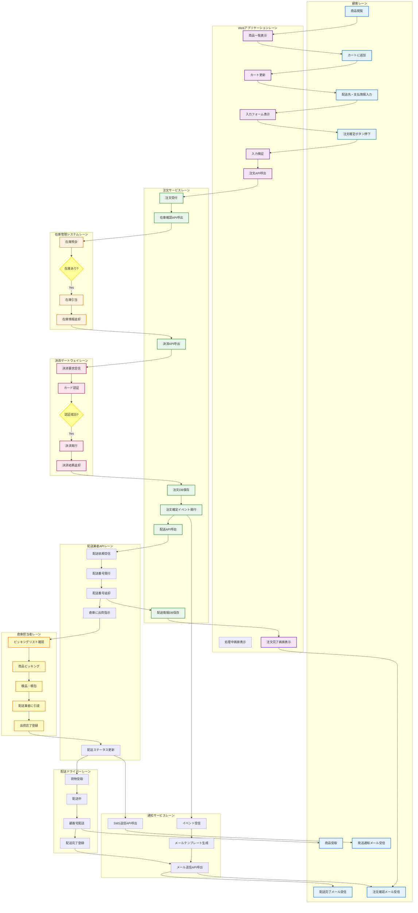
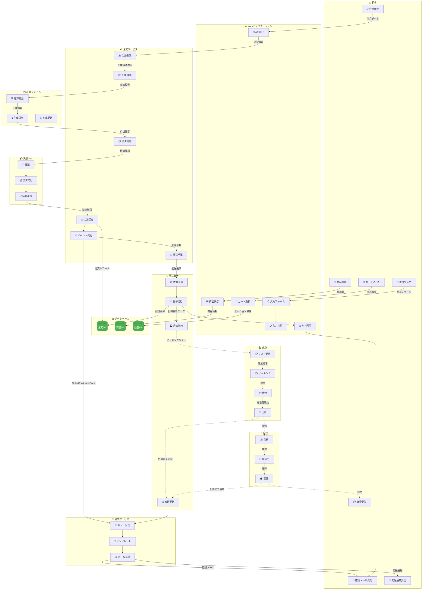
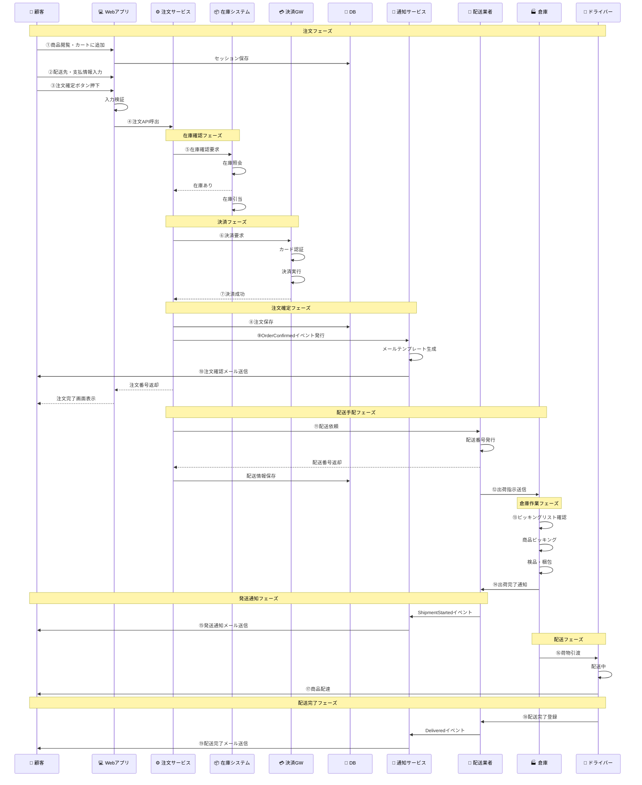
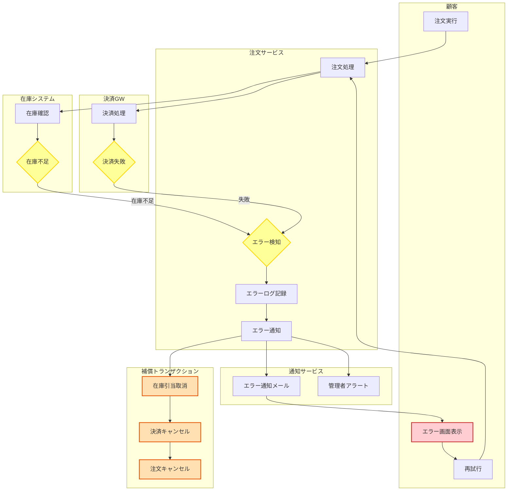
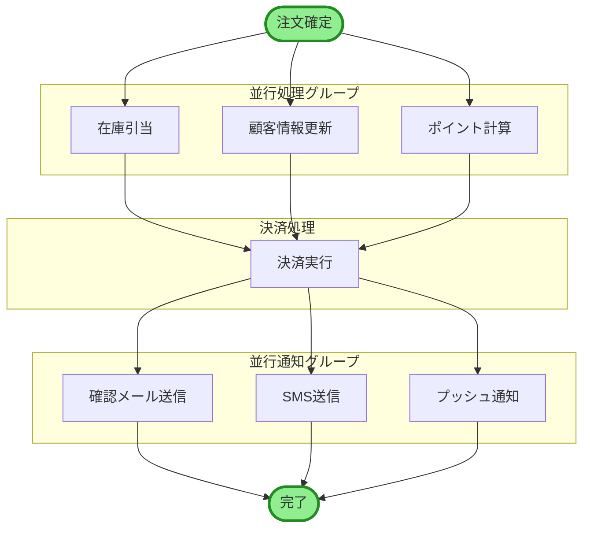

# ECサイト注文処理システム - スイムレーン図 (Swim Lane Diagram)

## スイムレーン図とは
プロセスの各ステップを担当者や部門ごとに「レーン（泳ぐコース）」に分けて表現する手法です。責任の所在とプロセスの流れを同時に可視化できます。

---

## スイムレーン図：注文から配送完了まで（全体フロー）



---

## スイムレーン図：詳細版（データと物の流れを明示）



---

## 時系列スイムレーン図（シーケンス形式）



---

## 責任分担表（RACI Matrix）

### 注文処理プロセス

| タスク | 顧客 | Webアプリ | 注文サービス | 在庫システム | 決済GW | 通知サービス | 配送業者 | 倉庫 |
|-------|-----|----------|------------|------------|--------|------------|---------|-----|
| **商品閲覧** | R | A | - | I | - | - | - | - |
| **カートに追加** | R | A | - | - | - | - | - | - |
| **配送先入力** | R | A | - | - | - | - | - | - |
| **注文確定** | R | C | A | - | - | - | - | - |
| **在庫確認** | - | - | R | A | - | - | - | I |
| **決済処理** | I | - | R | - | A | - | - | - |
| **注文保存** | - | - | A | - | - | - | - | - |
| **確認メール送信** | I | - | R | - | - | A | - | - |
| **配送手配** | - | - | R | - | - | - | A | I |
| **商品ピッキング** | - | - | - | - | - | - | I | A |
| **梱包作業** | - | - | - | - | - | - | I | A |
| **配送** | I | - | - | - | - | - | R | - |
| **配送完了通知** | I | - | - | - | - | A | R | - |

**凡例:**
- **R (Responsible)**: 実行責任者
- **A (Accountable)**: 説明責任者（最終意思決定者）
- **C (Consulted)**: 相談先
- **I (Informed)**: 報告先

---

## エラーハンドリング スイムレーン



---

## プロセスタイミング分析

### 各レーンの処理時間

| レーン | タスク | 最小時間 | 平均時間 | 最大時間 | 備考 |
|-------|-------|---------|---------|---------|------|
| **顧客** | 商品選択～注文確定 | 1分 | 5分 | 30分 | ユーザー操作 |
| **Webアプリ** | 入力検証～API呼出 | 0.1秒 | 0.5秒 | 2秒 | 同期処理 |
| **注文サービス** | 受付～確定 | 2秒 | 5秒 | 30秒 | 外部API含む |
| **在庫システム** | 在庫確認～引当 | 0.5秒 | 1秒 | 5秒 | DB処理 |
| **決済GW** | 認証～決済完了 | 2秒 | 3秒 | 10秒 | ネットワーク依存 |
| **通知サービス** | メール生成～送信 | 1秒 | 2秒 | 10秒 | 非同期処理 |
| **配送業者** | 番号発行～倉庫通知 | 5秒 | 10秒 | 30秒 | API処理 |
| **倉庫** | ピッキング～出荷 | 5分 | 15分 | 60分 | 人的作業 |
| **配送** | 集荷～配達完了 | 24時間 | 48時間 | 120時間 | 物理的配送 |

### クリティカルパス

```
顧客 → Webアプリ → 注文サービス → 在庫システム → 決済GW → DB保存 → 通知
```

**合計処理時間（注文確定まで）**: 約 **5-10秒**

---

## レーン間のインターフェース定義

### API / メッセージング

| 送信元レーン | 受信先レーン | インターフェース | プロトコル | データ形式 |
|------------|------------|----------------|----------|----------|
| Webアプリ | 注文サービス | POST /api/orders | REST API | JSON |
| 注文サービス | 在庫システム | POST /api/inventory/check | REST API | JSON |
| 注文サービス | 決済GW | POST /v1/payments | REST API | JSON |
| 注文サービス | 通知サービス | OrderConfirmedEvent | RabbitMQ | JSON |
| 注文サービス | 配送業者 | POST /api/shipments | REST API | XML/JSON |
| 配送業者 | 倉庫 | ShipmentRequestedEvent | SOAP/WebHook | XML |
| 通知サービス | 顧客 | メール送信 | SMTP | HTML |

---

## 並行処理の可視化



---

## まとめ

### スイムレーン図の利点

✅ **責任の明確化**: 各タスクの担当者・システムが一目瞭然  
✅ **プロセスの可視化**: 業務フロー全体を俯瞰  
✅ **ボトルネック発見**: 処理時間の長いレーンを特定  
✅ **インターフェース設計**: レーン間の連携方法を明示  
✅ **コミュニケーション**: ステークホルダー間の共通理解  

### 活用シーン

- **業務分析**: 現状プロセスの問題点発見
- **要件定義**: システム化範囲とステークホルダーの整理
- **設計**: API・メッセージング設計の基礎
- **テスト**: 結合テストシナリオ作成
- **運用**: 障害時の影響範囲特定

### 改善ポイントの発見

| レーン | 現状の問題 | 改善案 |
|-------|-----------|-------|
| **在庫システム** | API応答が遅い（3-5秒） | キャッシュ導入で1秒以内に |
| **決済GW** | タイムアウトが頻発 | リトライ処理の実装 |
| **倉庫** | ピッキングに時間がかかる | バーコードスキャン導入 |
| **通知サービス** | メール送信が同期処理 | 非同期化してレスポンス改善 |
