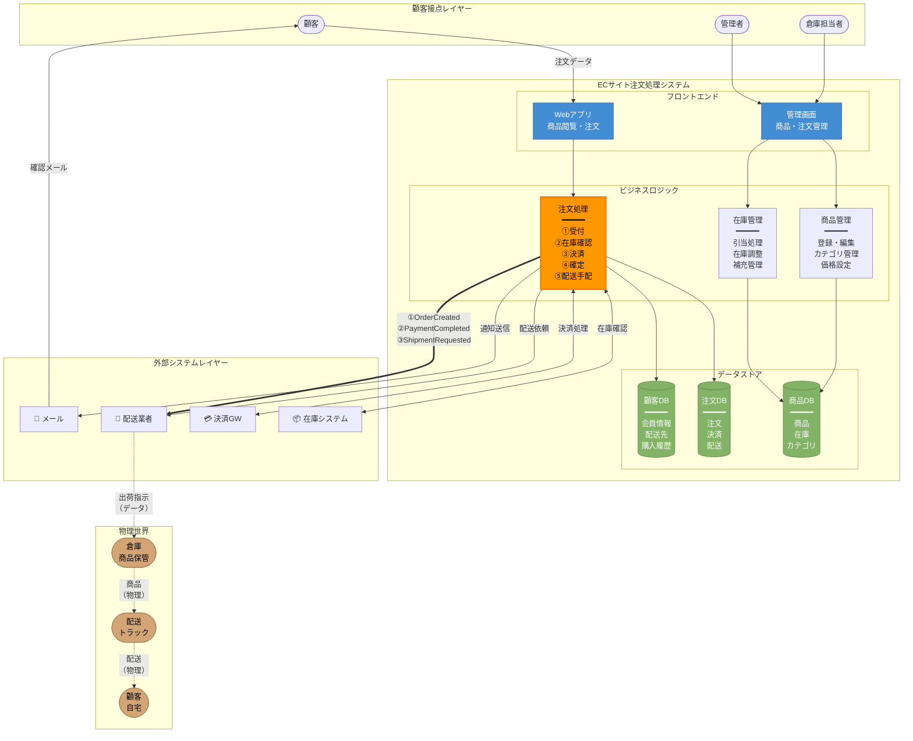
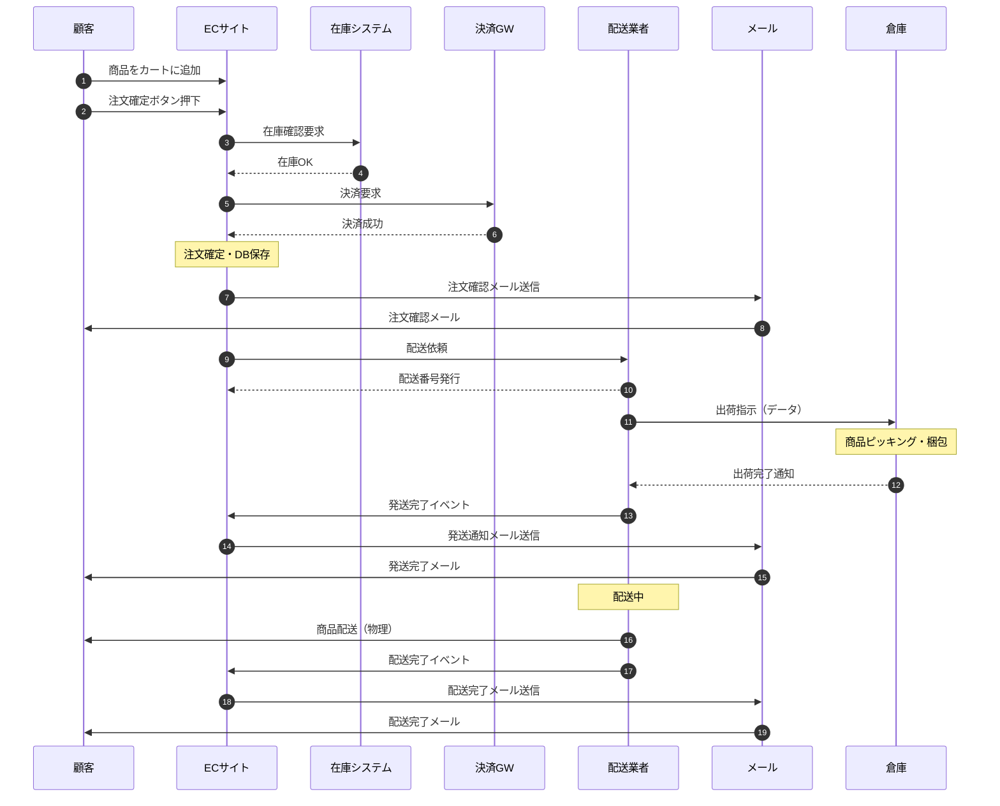
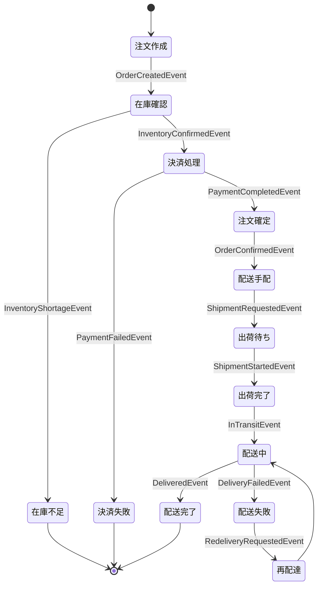
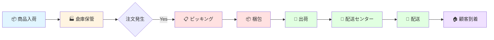

# ECサイト注文処理システム - システムコンテキストダイアグラム

## システムコンテキストダイアグラムとは
システムと外部エンティティ（人、他システム）との関係を一枚の図で表現し、システムの境界とスコープを明確にする手法です。

---

## システムコンテキストダイアグラム（全体俯瞰）

```mermaid
graph TB
    %% ========================================
    %% 人物（アクター）
    %% ========================================
    Customer([👤 顧客<br/>商品を購入するエンドユーザー])
    Admin([👤 管理者<br/>システム管理・運用担当者])
    Warehouse([👤 倉庫担当者<br/>出荷・在庫管理担当者])
    
    %% ========================================
    %% 中心システム
    %% ========================================
    ECSystem[🏪 ECサイト注文処理システム<br/>━━━━━━━━━━━━━━━━<br/>商品販売、注文管理、<br/>決済、配送手配を行う]
    
    %% ========================================
    %% 外部システム
    %% ========================================
    PaymentGW[💳 決済ゲートウェイ<br/>Stripe / PayPal<br/>クレジットカード決済処理]
    
    DeliveryAPI[🚚 配送業者システム<br/>ヤマト運輸 / 佐川急便<br/>配送手配・追跡管理]
    
    EmailService[📧 メール配信サービス<br/>SendGrid / AWS SES<br/>トランザクションメール送信]
    
    InventorySystem[📦 在庫管理システム<br/>既存WMSシステム<br/>リアルタイム在庫管理]
    
    SMSService[📱 SMS送信サービス<br/>Twilio<br/>配送通知・認証コード送信]
    
    AnalyticsSystem[📊 データ分析基盤<br/>Google Analytics / Tableau<br/>売上分析・行動分析]
    
    %% ========================================
    %% 顧客からの流れ
    %% ========================================
    Customer -->|①商品閲覧<br/>②カートに追加<br/>③注文実行<br/>④配送状況確認| ECSystem
    ECSystem -->|注文確認通知<br/>発送通知<br/>配送完了通知| Customer
    
    %% ========================================
    %% 管理者からの流れ
    %% ========================================
    Admin -->|商品登録・編集<br/>価格設定<br/>注文管理<br/>顧客管理| ECSystem
    ECSystem -->|売上レポート<br/>在庫アラート<br/>システム通知| Admin
    
    %% ========================================
    %% 倉庫担当者からの流れ
    %% ========================================
    Warehouse -->|出荷処理<br/>在庫調整<br/>返品処理| ECSystem
    ECSystem -->|ピッキングリスト<br/>出荷指示<br/>在庫状況| Warehouse
    
    %% ========================================
    %% 外部システム連携
    %% ========================================
    ECSystem -->|💰 決済要求<br/>（金額、カード情報、注文ID）| PaymentGW
    PaymentGW -->|✅ 決済結果<br/>（承認番号、決済ID、結果コード）| ECSystem
    
    ECSystem -->|📮 配送依頼<br/>（配送先、商品情報、希望日時）| DeliveryAPI
    DeliveryAPI -->|📍 配送状況<br/>（配送番号、ステータス、位置情報）| ECSystem
    
    ECSystem -->|✉️ メール送信要求<br/>（宛先、件名、本文、テンプレート）| EmailService
    EmailService -->|📤 送信結果<br/>（送信ID、ステータス、エラー情報）| ECSystem
    
    ECSystem -->|🔍 在庫照会<br/>（商品ID、数量、引当要求）| InventorySystem
    InventorySystem -->|📊 在庫情報<br/>（現在庫、引当可能数、入荷予定）| ECSystem
    
    ECSystem -->|📲 SMS送信要求<br/>（電話番号、メッセージ）| SMSService
    SMSService -->|✓ 送信完了| ECSystem
    
    ECSystem -->|📈 イベントデータ<br/>（注文、閲覧、購入行動）| AnalyticsSystem
    
    %% ========================================
    %% スタイル定義
    %% ========================================
    style ECSystem fill:#1168bd,stroke:#0b4884,stroke-width:4px,color:#ffffff
    style Customer fill:#08427b,stroke:#052e56,stroke-width:2px,color:#ffffff
    style Admin fill:#08427b,stroke:#052e56,stroke-width:2px,color:#ffffff
    style Warehouse fill:#08427b,stroke:#052e56,stroke-width:2px,color:#ffffff
    style PaymentGW fill:#999999,stroke:#6b6b6b,stroke-width:2px,color:#ffffff
    style DeliveryAPI fill:#999999,stroke:#6b6b6b,stroke-width:2px,color:#ffffff
    style EmailService fill:#999999,stroke:#6b6b6b,stroke-width:2px,color:#ffffff
    style InventorySystem fill:#999999,stroke:#6b6b6b,stroke-width:2px,color:#ffffff
    style SMSService fill:#999999,stroke:#6b6b6b,stroke-width:2px,color:#ffffff
    style AnalyticsSystem fill:#999999,stroke:#6b6b6b,stroke-width:2px,color:#ffffff
```

---

## 統合ビュー：データ・イベント・物の流れを一枚に

---

## 要素別詳細説明

### 👥 人物（アクター）

| アクター | 役割 | 主な操作 | システムからの情報 |
|---------|------|---------|------------------|
| **顧客** | 商品購入者 | ・商品閲覧 ・カートに追加 ・注文実行 ・配送状況確認 | ・注文確認メール ・発送通知 ・配送完了通知 |
| **管理者** | システム運用者 | ・商品登録/編集 ・価格設定 ・注文管理 ・顧客対応 | ・売上レポート ・在庫アラート ・システム通知 |
| **倉庫担当者** | 物流担当者 | ・出荷処理 ・在庫調整 ・返品処理 ・棚卸 | ・ピッキングリスト ・出荷指示 ・在庫状況 |

### 🖥️ 中心システム

| システム | 責務 | 主要機能 |
|---------|------|---------|
| **ECサイト注文処理システム** | 商品販売から配送までのエンドツーエンド管理 | ・商品カタログ管理 ・ショッピングカート ・注文受付・処理 ・決済連携 ・配送手配 ・顧客管理 ・在庫管理 |

### 🔗 外部システム

| 外部システム | 提供サービス | データ送信 | データ受信 |
|------------|------------|----------|----------|
| **決済ゲートウェイ** | クレジットカード決済処理 | 金額、カード情報、注文ID | 承認番号、決済ID、結果コード |
| **配送業者システム** | 配送手配・追跡 | 配送先住所、商品情報、希望日時 | 配送番号、配送ステータス、位置情報 |
| **メール配信サービス** | トランザクションメール送信 | 宛先、件名、本文、テンプレート | 送信ID、送信結果、エラー情報 |
| **在庫管理システム** | リアルタイム在庫管理 | 商品ID、引当要求、数量 | 現在庫数、引当可能数、入荷予定 |
| **SMS送信サービス** | 配送通知・認証コード送信 | 電話番号、メッセージ内容 | 送信完了、エラー情報 |
| **データ分析基盤** | 売上・行動分析 | 注文データ、閲覧履歴、購入行動 | （なし：一方向送信） |

---

## データフロー詳細

### 📊 注文フロー（時系列）

---

## イベント駆動設計

### 主要ビジネスイベント

### イベント一覧

| イベント名 | 発生タイミング | 発行元 | 購読者 |
|-----------|--------------|-------|-------|
| `OrderCreatedEvent` | 顧客が注文ボタンを押下 | 注文サービス | 在庫サービス、通知サービス |
| `InventoryConfirmedEvent` | 在庫が確保された | 在庫サービス | 注文サービス |
| `PaymentCompletedEvent` | 決済が完了 | 決済サービス | 注文サービス、会計システム |
| `OrderConfirmedEvent` | 注文が確定 | 注文サービス | 配送サービス、通知サービス |
| `ShipmentRequestedEvent` | 配送が依頼された | 注文サービス | 配送業者、倉庫システム |
| `ShipmentStartedEvent` | 商品が出荷された | 配送業者 | 注文サービス、通知サービス |
| `DeliveredEvent` | 商品が配送完了 | 配送業者 | 注文サービス、通知サービス |

---

## 物の流れ（サプライチェーン）

### 物流フェーズ詳細

| フェーズ | 場所 | 処理内容 | データ記録 | 所要時間 |
|---------|------|---------|-----------|---------|
| **1. 入荷** | 倉庫 | 商品受け取り、検品 | 入荷記録、ロット番号 | 1-2時間 |
| **2. 保管** | 倉庫 | 棚入れ、在庫管理 | 保管場所、在庫数 | - |
| **3. ピッキング** | 倉庫 | 注文商品を棚から取り出し | ピッキングリスト完了 | 5-15分 |
| **4. 梱包** | 倉庫 | 商品梱包、伝票貼付 | 梱包完了、重量測定 | 5-10分 |
| **5. 出荷** | 倉庫 | 配送業者に引き渡し | 出荷記録、配送番号 | 即時 |
| **6. 配送** | 配送中 | トラックで配送 | 配送ステータス更新 | 1-3日 |
| **7. 到着** | 顧客宅 | 顧客に手渡し | 配送完了、署名 | 即時 |

---

## システム境界と責務

### システムが行うこと（内部）
✅ 商品カタログの管理  
✅ ショッピングカート機能  
✅ 注文受付・処理  
✅ 顧客情報管理  
✅ 注文ステータス管理  
✅ 決済連携（ゲートウェイ経由）  
✅ 配送手配（API経由）  
✅ 通知送信（メール・SMS）  
✅ 売上・在庫レポート  

### システムが行わないこと（外部依存）
❌ 実際の決済処理（決済GWが実施）  
❌ 物理的な商品配送（配送業者が実施）  
❌ メールサーバー運用（メールサービスが実施）  
❌ 倉庫の在庫物理管理（WMSが実施）  
❌ SMS送信インフラ（SMSサービスが実施）  

---

## 非機能要件とシステム連携

### セキュリティ

| 項目 | 実装方法 | 対象 |
|-----|---------|------|
| **認証・認可** | JWT、OAuth 2.0 | 顧客、管理者 |
| **通信暗号化** | HTTPS/TLS 1.3 | 全通信 |
| **決済情報** | トークン化（非保持） | 決済GW連携 |
| **個人情報** | 暗号化、アクセス制御 | 顧客DB |
| **API認証** | APIキー、署名検証 | 外部システム連携 |

### パフォーマンス

| 要件 | 目標値 | 実現方法 |
|-----|-------|---------|
| **応答時間** | < 2秒 | CDN、キャッシュ（Redis） |
| **同時接続数** | 10,000ユーザー | ロードバランサー、水平スケール |
| **注文処理** | 1,000件/分 | 非同期処理、メッセージキュー |
| **可用性** | 99.9% | 冗長構成、ヘルスチェック |

### 外部システム障害時の対応

| 外部システム | 障害時の動作 | リトライ戦略 |
|------------|------------|------------|
| **決済GW** | 決済エラー表示、注文保留 | 指数バックオフ、最大3回 |
| **配送API** | 手動配送手配に切替 | タイムアウト30秒、リトライ2回 |
| **メールサービス** | キューに保存、後で再送 | 最大24時間、10分間隔 |
| **在庫システム** | ローカル在庫データ使用 | サーキットブレーカー適用 |

---

## まとめ

### このシステムコンテキストダイアグラムが示すもの

✅ **システムの境界**: ECサイトが何を担当し、何を外部に依存するか  
✅ **ステークホルダー**: 顧客、管理者、倉庫担当者の役割  
✅ **データの流れ**: 注文情報、決済データ、配送情報の流れ  
✅ **イベントの流れ**: 注文確定、決済完了、配送開始などのビジネスイベント  
✅ **物の流れ**: 倉庫から顧客への商品配送の物理的な流れ  
✅ **外部システム連携**: 6つの外部システムとの連携方法  
✅ **責務の明確化**: システムが行うこと/行わないことの明確な区分  

### 活用方法

- **要件定義**: システムスコープの合意形成
- **設計**: インターフェース設計の基礎資料
- **開発**: 外部連携仕様の参照
- **運用**: 障害発生時の影響範囲特定
- **コミュニケーション**: ステークホルダー間の共通理解
