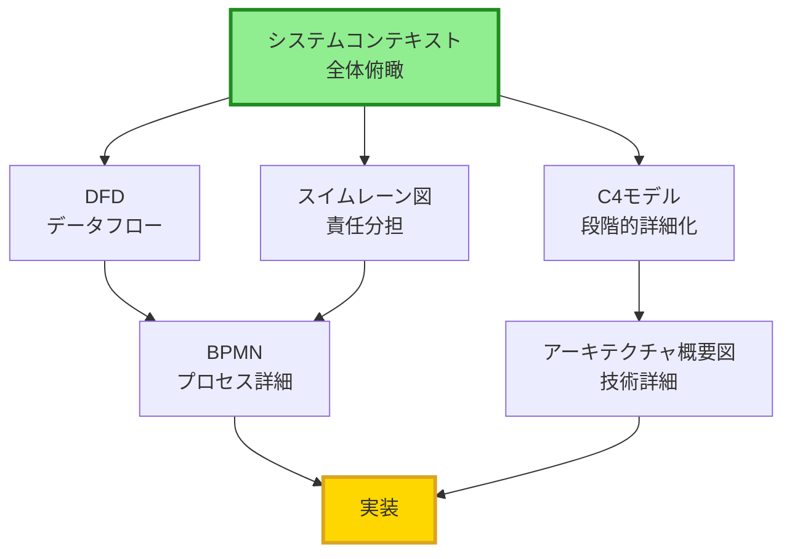

# ECサイト注文処理システム - 可視化手法の比較評価

## 概要
ECサイトの注文処理業務を6つの異なる手法で可視化し、それぞれの特徴、強み、弱み、適用シーンを比較評価します。

---

## 📊 可視化手法一覧

| # | 手法名 | ファイル名 | 作成日時 | サイズ |
|---|--------|-----------|---------|--------|
| 1 | データフローダイアグラム (DFD) | ec-site-dfd.md | 2025/11/17 | 6.5 KB |
| 2 | C4モデル | ec-site-c4-model.md | 2025/11/17 | 19.5 KB |
| 3 | システムコンテキストダイアグラム | ec-site-system-context-diagram.md | 2025/11/17 | 19.3 KB |
| 4 | BPMN | ec-site-bpmn.md | 2025/11/17 | 18.8 KB |
| 5 | アーキテクチャ概要図 | ec-site-architecture-overview.md | 2025/11/17 | 21.2 KB |
| 6 | スイムレーン図 | ec-site-swimlane.md | 2025/11/17 | 20.5 KB |

---

## 📋 総合比較表

| 評価項目 | DFD | C4モデル | システムコンテキスト | BPMN | アーキテクチャ概要図 | スイムレーン図 |
|---------|-----|---------|-------------------|------|------------------|--------------|
| **理解しやすさ** | ⭐⭐⭐⭐ | ⭐⭐⭐ | ⭐⭐⭐⭐⭐ | ⭐⭐⭐ | ⭐⭐⭐ | ⭐⭐⭐⭐ |
| **詳細度** | ⭐⭐⭐ | ⭐⭐⭐⭐⭐ | ⭐⭐ | ⭐⭐⭐⭐⭐ | ⭐⭐⭐⭐⭐ | ⭐⭐⭐⭐ |
| **技術詳細** | ⭐⭐ | ⭐⭐⭐⭐ | ⭐⭐ | ⭐⭐ | ⭐⭐⭐⭐⭐ | ⭐⭐ |
| **ビジネス視点** | ⭐⭐⭐⭐ | ⭐⭐⭐ | ⭐⭐⭐⭐⭐ | ⭐⭐⭐⭐⭐ | ⭐⭐ | ⭐⭐⭐⭐⭐ |
| **責任の明確化** | ⭐⭐ | ⭐⭐⭐ | ⭐⭐⭐ | ⭐⭐⭐ | ⭐⭐ | ⭐⭐⭐⭐⭐ |
| **データフロー** | ⭐⭐⭐⭐⭐ | ⭐⭐⭐ | ⭐⭐⭐ | ⭐⭐⭐⭐ | ⭐⭐⭐ | ⭐⭐⭐⭐ |
| **プロセスフロー** | ⭐⭐⭐ | ⭐⭐ | ⭐⭐ | ⭐⭐⭐⭐⭐ | ⭐⭐ | ⭐⭐⭐⭐⭐ |
| **システム構成** | ⭐⭐ | ⭐⭐⭐⭐⭐ | ⭐⭐⭐⭐ | ⭐⭐ | ⭐⭐⭐⭐⭐ | ⭐⭐ |
| **標準化** | ⭐⭐⭐ | ⭐⭐⭐⭐ | ⭐⭐⭐ | ⭐⭐⭐⭐⭐ | ⭐⭐ | ⭐⭐⭐ |
| **保守性** | ⭐⭐⭐ | ⭐⭐⭐⭐ | ⭐⭐⭐⭐ | ⭐⭐⭐⭐ | ⭐⭐⭐ | ⭐⭐⭐ |
| **学習コスト** | 低 | 中 | 低 | 高 | 中 | 低 |
| **作成工数** | 小 | 大 | 中 | 大 | 大 | 中 |

**評価基準**: ⭐ (1: 低い) ～ ⭐⭐⭐⭐⭐ (5: 高い)

---

## 🎯 手法別詳細評価

### 1. データフローダイアグラム (DFD)

#### 📝 概要
データの流れに焦点を当て、プロセス、データストア、外部エンティティ間のデータの動きを可視化。

#### ✅ 強み
- **シンプルで理解しやすい**: 記号が少なく、初見でも理解可能
- **データフロー特化**: データの流れが明確に追跡できる
- **階層化が容易**: レベル0, 1, 2と段階的に詳細化可能
- **ビジネス分析向き**: 非技術者でも理解しやすい
- **問題発見**: データの不整合やボトルネックを発見しやすい

#### ❌ 弱み
- **時系列が曖昧**: プロセスの実行順序が不明確
- **責任が不明確**: 誰が何をするかが分かりにくい
- **技術詳細不足**: 実装レベルの情報が少ない
- **エラー処理**: 例外フローの表現が難しい
- **システム構成**: インフラや技術スタックが表現できない

#### 🎯 適用シーン
- ✓ 要件定義フェーズ
- ✓ 業務分析・データ分析
- ✓ データベース設計の基礎
- ✓ ステークホルダーへの説明
- ✓ データの流れの問題発見

#### 👥 対象者
- **最適**: ビジネスアナリスト、業務担当者、プロジェクトマネージャー
- **適合**: システムアナリスト、データベース設計者
- **不向き**: インフラエンジニア、DevOpsエンジニア

---

### 2. C4モデル

#### 📝 概要
4つのレベル（Context, Container, Component, Code）で段階的にシステムを詳細化。

#### ✅ 強み
- **段階的詳細化**: ズームイン/アウトで異なる視点を提供
- **包括的**: システム全体から個別コンポーネントまでカバー
- **技術スタック明示**: 使用技術が明確
- **境界の明確化**: システムの責任範囲が明確
- **モダンな手法**: マイクロサービス時代に適合

#### ❌ 弱み
- **学習コスト**: 4つのレベルの使い分けが必要
- **作成工数**: 複数の図を作成する必要がある
- **プロセスフロー**: 業務フローの表現は苦手
- **標準化不足**: BPMNほど厳密な標準がない
- **ツール依存**: 専用ツールが必要な場合がある

#### 🎯 適用シーン
- ✓ システム設計フェーズ
- ✓ アーキテクチャレビュー
- ✓ 技術選定の議論
- ✓ 新メンバーへのオンボーディング
- ✓ ドキュメント整備

#### 👥 対象者
- **最適**: ソフトウェアアーキテクト、技術リード
- **適合**: 開発者、テックリード
- **不向き**: 非技術系ステークホルダー

---

### 3. システムコンテキストダイアグラム

#### 📝 概要
システムと外部エンティティとの関係を一枚の図で表現。システムの境界とスコープを明確化。

#### ✅ 強み
- **最も理解しやすい**: 一目でシステム全体を把握
- **スコープ明確化**: システムの境界が明確
- **ステークホルダー可視化**: 関係者全員が一覧できる
- **外部連携明示**: 外部システムとの関係が明確
- **コミュニケーションツール**: 合意形成に最適

#### ❌ 弱み
- **詳細度不足**: 内部の詳細は表現できない
- **プロセス不明**: 業務フローが分からない
- **技術詳細不足**: 実装方法が不明
- **データフロー**: データの詳細な流れが追えない
- **時系列不明**: 処理の順序が分からない

#### 🎯 適用シーン
- ✓ プロジェクト初期フェーズ
- ✓ ステークホルダー説明
- ✓ スコープ定義
- ✓ 外部連携の整理
- ✓ 要件定義の開始時

#### 👥 対象者
- **最適**: 全ステークホルダー（経営層、業務担当者、開発者）
- **適合**: プロジェクトマネージャー、ビジネスアナリスト
- **不向き**: なし（全員に有効）

---

### 4. BPMN (Business Process Model and Notation)

#### 📝 概要
国際標準（ISO/IEC 19510）に準拠したビジネスプロセスモデリング記法。

#### ✅ 強み
- **国際標準**: 世界共通の記法で再現性が高い
- **実行可能**: BPMエンジンで直接実行できる
- **詳細性**: タスク、イベント、ゲートウェイで精密に表現
- **プロセス分析**: ボトルネック、サイクルタイムを測定可能
- **自動化対応**: RPA・ワークフローエンジンに直結

#### ❌ 弱み
- **学習コスト高**: 記法が複雑で習得に時間がかかる
- **作成工数大**: 詳細に書くと非常に複雑になる
- **可読性**: 複雑なプロセスは読みづらい
- **システム構成**: インフラや技術詳細は表現不可
- **ツール依存**: 専用ツールが推奨される

#### 🎯 適用シーン
- ✓ 業務プロセス改善（BPR）
- ✓ ワークフロー自動化
- ✓ プロセスマイニング
- ✓ 業務標準化
- ✓ ISO準拠が必要な場合

#### 👥 対象者
- **最適**: ビジネスプロセスアナリスト、業務改善担当者
- **適合**: プロジェクトマネージャー、RPA開発者
- **不向き**: インフラエンジニア、初心者

---

### 5. アーキテクチャ概要図

#### 📝 概要
システムの技術的構成要素、レイヤー構造、技術スタック、デプロイメントを包括的に表現。

#### ✅ 強み
- **技術詳細**: 技術スタック、バージョン、構成が明確
- **インフラ可視化**: デプロイメント、ネットワーク構成が明確
- **非機能要件**: スケーラビリティ、セキュリティ戦略を表現
- **実装ガイド**: 開発者の実装指針になる
- **運用設計**: 監視、ログ、DR戦略も含む

#### ❌ 弱み
- **ビジネス視点弱**: 業務フローが分かりにくい
- **非技術者には難解**: 技術知識が必要
- **保守コスト**: 技術変更時の更新が必要
- **プロセス不明**: 業務の流れが追いにくい
- **作成工数大**: 詳細に書くと膨大

#### 🎯 適用シーン
- ✓ 詳細設計フェーズ
- ✓ 技術選定
- ✓ インフラ設計
- ✓ セキュリティ審査
- ✓ 運用設計

#### 👥 対象者
- **最適**: ソフトウェアアーキテクト、インフラエンジニア、DevOpsエンジニア
- **適合**: シニア開発者、セキュリティエンジニア
- **不向き**: ビジネス担当者、非技術系ステークホルダー

---

### 6. スイムレーン図 (Swim Lane Diagram)

#### 📝 概要
プロセスを担当者・部門ごとに「レーン」に分け、責任の所在とフローを同時に可視化。

#### ✅ 強み
- **責任明確化**: 誰が何をするかが一目瞭然
- **ビジネス視点**: 業務フローと組織を統合表現
- **コミュニケーション**: 部門間の連携が明確
- **ボトルネック発見**: レーン間の待ち時間を特定
- **RACI対応**: 責任分担表と組み合わせ可能

#### ❌ 弱み
- **技術詳細不足**: 実装方法は表現できない
- **レーン数制約**: レーンが多いと見づらくなる
- **システム構成**: インフラ構成は表現不可
- **データ構造**: データベース設計には不向き
- **標準化**: BPMNほど厳密な標準はない

#### 🎯 適用シーン
- ✓ 業務フロー整理
- ✓ 部門間連携の可視化
- ✓ 責任分担の明確化
- ✓ 業務改善（ムダ取り）
- ✓ API設計の基礎

#### 👥 対象者
- **最適**: ビジネスアナリスト、業務担当者、プロジェクトマネージャー
- **適合**: 開発者、テストエンジニア
- **不向き**: インフラエンジニア（単独使用時）

---

## 🔍 フェーズ別推奨手法

### プロジェクトライフサイクル別

| フェーズ | 推奨手法（優先順） | 理由 |
|---------|-----------------|------|
| **企画・構想** | 1. システムコンテキスト<br/>2. スイムレーン図 | スコープ定義、ステークホルダー整理 |
| **要件定義** | 1. DFD<br/>2. スイムレーン図<br/>3. システムコンテキスト | データフロー、業務フロー、責任分担の明確化 |
| **基本設計** | 1. C4モデル<br/>2. BPMN<br/>3. DFD | アーキテクチャ設計、プロセス詳細化 |
| **詳細設計** | 1. アーキテクチャ概要図<br/>2. C4モデル | 技術詳細、実装方針の決定 |
| **実装** | 1. アーキテクチャ概要図<br/>2. C4モデル（Component） | 開発ガイド、コンポーネント設計 |
| **テスト** | 1. スイムレーン図<br/>2. BPMN | テストシナリオ作成、E2Eテスト |
| **運用・保守** | 1. アーキテクチャ概要図<br/>2. システムコンテキスト | 障害対応、影響範囲特定 |
| **業務改善** | 1. BPMN<br/>2. スイムレーン図<br/>3. DFD | プロセス分析、ボトルネック発見 |

---

## 🎯 目的別推奨手法

### 分析・設計目的別

| 目的 | 最適な手法 | 理由 |
|-----|-----------|------|
| **データの流れを理解したい** | DFD | データフローに特化 |
| **業務フローを整理したい** | BPMN、スイムレーン図 | プロセス表現が得意 |
| **責任分担を明確にしたい** | スイムレーン図 | レーン分けで責任明確 |
| **システム全体を俯瞰したい** | システムコンテキスト、C4（Context） | 一枚で全体像を把握 |
| **技術選定したい** | アーキテクチャ概要図、C4モデル | 技術詳細を表現 |
| **外部連携を整理したい** | システムコンテキスト、DFD | 外部エンティティを明示 |
| **ボトルネックを発見したい** | BPMN、スイムレーン図 | プロセス分析機能 |
| **実装ガイドが欲しい** | アーキテクチャ概要図、C4（Component） | 技術詳細を提供 |
| **ステークホルダーに説明したい** | システムコンテキスト、スイムレーン図 | 理解しやすい |
| **プロセス自動化したい** | BPMN | 実行可能な標準記法 |

---

## 👥 ステークホルダー別推奨手法

| ステークホルダー | 最適な手法 | 見るべきポイント |
|----------------|-----------|---------------|
| **経営層** | システムコンテキスト | システムの価値、投資対効果 |
| **プロジェクトマネージャー** | スイムレーン図、BPMN | スケジュール、リソース、リスク |
| **ビジネスアナリスト** | DFD、スイムレーン図、BPMN | 業務フロー、データフロー |
| **業務担当者** | スイムレーン図、システムコンテキスト | 自分の役割、業務の変化 |
| **ソフトウェアアーキテクト** | C4モデル、アーキテクチャ概要図 | 技術選定、非機能要件 |
| **開発者** | アーキテクチャ概要図、C4（Component） | 実装方針、API仕様 |
| **インフラエンジニア** | アーキテクチャ概要図 | デプロイメント、ネットワーク |
| **テストエンジニア** | スイムレーン図、BPMN | テストシナリオ、E2Eフロー |
| **運用担当者** | アーキテクチャ概要図、システムコンテキスト | 監視項目、障害対応 |
| **セキュリティ担当者** | アーキテクチャ概要図、システムコンテキスト | 脅威分析、アクセス制御 |

---

## 🔄 組み合わせ戦略

### 効果的な組み合わせパターン

#### パターン1: 要件定義セット
```
システムコンテキスト（全体像）
    ↓
DFD（データフロー詳細）
    ↓
スイムレーン図（責任分担）
```
**効果**: ビジネス要件を網羅的にカバー

#### パターン2: システム設計セット
```
システムコンテキスト（境界定義）
    ↓
C4モデル（段階的詳細化）
    ↓
アーキテクチャ概要図（技術詳細）
```
**効果**: 技術設計を段階的に詳細化

#### パターン3: 業務分析セット
```
スイムレーン図（現状把握）
    ↓
BPMN（詳細分析）
    ↓
DFD（データ分析）
```
**効果**: 業務改善のための分析

#### パターン4: 全体カバレッジセット
```
1. システムコンテキスト（全体俯瞰）
2. BPMN（業務プロセス）
3. C4モデル（システム構造）
4. アーキテクチャ概要図（技術詳細）
```
**効果**: すべての観点を網羅

---

## 📊 定量評価マトリクス

### 工数・効果マトリクス

| 手法 | 作成工数 | 理解容易性 | 情報量 | ROI | 総合評価 |
|-----|---------|----------|-------|-----|---------|
| **システムコンテキスト** | 2時間 | ⭐⭐⭐⭐⭐ | 中 | ⭐⭐⭐⭐⭐ | 4.7 |
| **DFD** | 4時間 | ⭐⭐⭐⭐ | 中 | ⭐⭐⭐⭐ | 4.2 |
| **スイムレーン図** | 6時間 | ⭐⭐⭐⭐ | 高 | ⭐⭐⭐⭐ | 4.3 |
| **C4モデル** | 12時間 | ⭐⭐⭐ | 最高 | ⭐⭐⭐⭐ | 4.0 |
| **BPMN** | 16時間 | ⭐⭐⭐ | 最高 | ⭐⭐⭐ | 3.5 |
| **アーキテクチャ概要図** | 20時間 | ⭐⭐⭐ | 最高 | ⭐⭐⭐⭐ | 3.8 |

**ROI (投資対効果)**: 作成コストに対する価値

---

## 🎓 学習難易度と習得時間

| 手法 | 学習難易度 | 習得時間（目安） | 前提知識 |
|-----|-----------|---------------|---------|
| **システムコンテキスト** | ⭐ 易 | 1-2時間 | なし |
| **DFD** | ⭐⭐ 易 | 半日 | システム分析の基礎 |
| **スイムレーン図** | ⭐⭐ 易 | 半日 | 業務フローの理解 |
| **C4モデル** | ⭐⭐⭐ 中 | 2-3日 | ソフトウェアアーキテクチャ |
| **BPMN** | ⭐⭐⭐⭐ 難 | 1週間 | ビジネスプロセス管理 |
| **アーキテクチャ概要図** | ⭐⭐⭐ 中 | 2-3日 | システム設計、インフラ知識 |

---

## ✅ 実務での選択ガイド

### クイック判断フローチャート

```
Q1: 対象者は技術者？
├─ Yes → Q2: 技術詳細が必要？
│         ├─ Yes → アーキテクチャ概要図
│         └─ No  → C4モデル
│
└─ No  → Q3: プロセス重視？
          ├─ Yes → Q4: 責任分担も必要？
          │         ├─ Yes → スイムレーン図
          │         └─ No  → BPMN or DFD
          │
          └─ No  → システムコンテキスト
```

### シンプルな選択基準

| こんな時は... | この手法を選ぶ |
|-------------|-------------|
| **とにかく全体像を素早く把握したい** | システムコンテキスト |
| **データの流れを追いたい** | DFD |
| **誰が何をするか明確にしたい** | スイムレーン図 |
| **業務プロセスを詳細に分析したい** | BPMN |
| **システム設計を段階的に詳細化したい** | C4モデル |
| **技術選定・インフラ設計したい** | アーキテクチャ概要図 |

---

## 🚀 実践的推奨事項

### 小規模プロジェクト（3ヶ月未満）
1. **システムコンテキスト** - 全体把握
2. **スイムレーン図** - 業務フロー整理
3. 必要に応じて **DFD** または **C4モデル（Context/Container）**

### 中規模プロジェクト（3-12ヶ月）
1. **システムコンテキスト** - スコープ定義
2. **DFD** - データフロー分析
3. **スイムレーン図** - 責任分担
4. **C4モデル** - システム設計
5. **アーキテクチャ概要図** - 技術詳細

### 大規模プロジェクト（1年以上）
1. **システムコンテキスト** - ステークホルダー合意
2. **DFD** - データ分析
3. **BPMN** - 業務プロセス標準化
4. **スイムレーン図** - 責任分担・連携
5. **C4モデル** - 包括的設計
6. **アーキテクチャ概要図** - 実装ガイド

---

## 📈 まとめ：各手法の位置づけ

```
        高
        │
技      │  アーキテクチャ概要図
術      │         ●
詳      │              C4モデル
細      │                 ●
度      │
        │      BPMN
        │        ●
        │           スイムレーン図     DFD
        │              ●             ●
低      │                 システムコンテキスト
        │                        ●
        └─────────────────────────────
         ビジネス                    技術
              ←  対象領域  →
```

### 結論：どの手法を使うべきか？

**答え: 目的とステークホルダーによる**

1. **初期フェーズ**: システムコンテキストで合意形成
2. **要件定義**: DFD + スイムレーン図で業務整理
3. **設計フェーズ**: C4モデル + アーキテクチャ概要図
4. **業務改善**: BPMN + スイムレーン図

**重要**: 1つの手法に固執せず、目的に応じて組み合わせることが成功の鍵

---

## 🔗 参考：各手法の関連性



**各手法は独立しているが、相互に補完し合う関係**

---

## 📚 学習リソース推奨

| 手法 | 推奨書籍・リソース | 難易度 |
|-----|-----------------|-------|
| **DFD** | 『システム分析・設計』（オーム社） | ⭐⭐ |
| **C4モデル** | c4model.com 公式サイト | ⭐⭐⭐ |
| **システムコンテキスト** | 『ソフトウェアアーキテクチャの基礎』 | ⭐⭐ |
| **BPMN** | 『BPMN 2.0ハンドブック』 | ⭐⭐⭐⭐ |
| **アーキテクチャ図** | 『ソフトウェアアーキテクチャ・ハードパーツ』 | ⭐⭐⭐⭐ |
| **スイムレーン図** | 『ビジネスプロセスの教科書』 | ⭐⭐ |

---

## 🎯 最終推奨：ECサイトプロジェクトの場合

### 最小セット（必須）
1. **システムコンテキスト** - 全体像把握
2. **スイムレーン図** - 業務フロー・責任分担

### 標準セット（推奨）
1. **システムコンテキスト** - 全体像
2. **DFD** - データフロー
3. **スイムレーン図** - 責任分担
4. **C4モデル（Context + Container）** - システム設計

### フルセット（理想）
1. **システムコンテキスト** - ステークホルダー合意
2. **DFD** - データ分析
3. **スイムレーン図** - 業務フロー・責任
4. **BPMN** - プロセス詳細・自動化
5. **C4モデル** - 段階的設計
6. **アーキテクチャ概要図** - 技術実装

**プロジェクトの規模・期間・メンバーのスキルに応じて選択してください**
